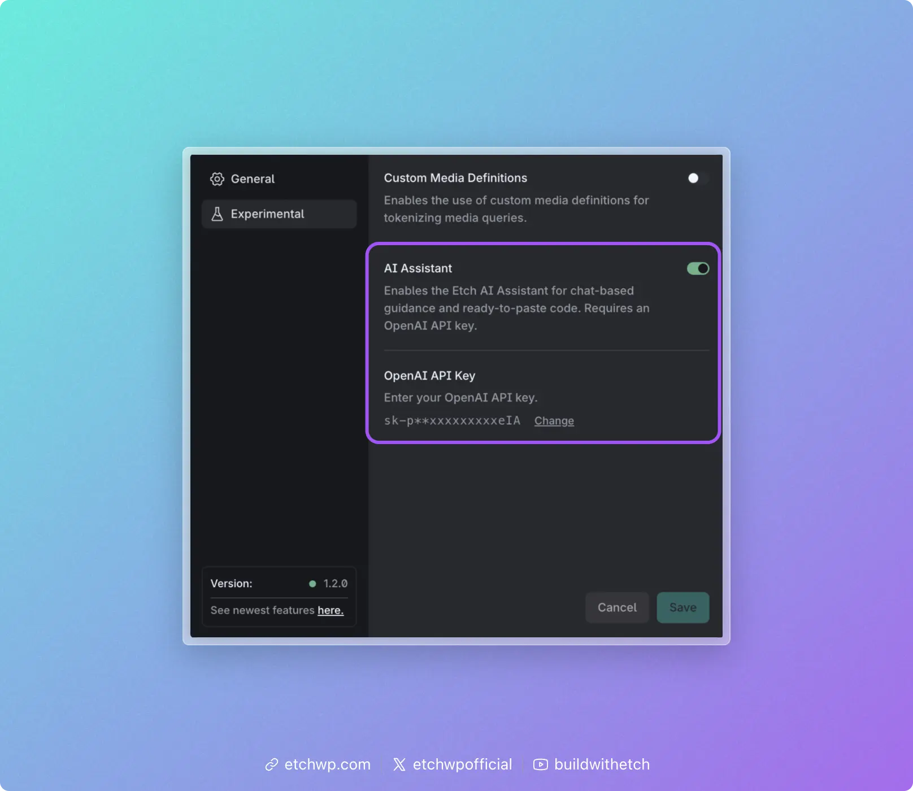

# Activating AI in Etch

Etch includes an AI assistant that provides chat-based guidance and assistance. The AI feature is currently experimental and requires an OpenAI API key.

## Getting an OpenAI API Key

1. Go to [platform.openai.com](https://platform.openai.com/) and create an account (or sign in)
2. Navigate to **API Keys** in the left sidebar (or go directly to [platform.openai.com/api-keys](https://platform.openai.com/api-keys))
3. Click **Create new secret key**
4. Give it a name (e.g., "Etch") and click **Create secret key**
5. Copy the key — you won't be able to see it again after closing the dialog

:::warning
Keep your API key private. Never share it publicly or commit it to version control. OpenAI charges based on usage, so a leaked key can result in unexpected charges.
:::

You'll also need to add a payment method to your OpenAI account. API usage is billed separately from ChatGPT subscriptions — even if you pay for ChatGPT Plus, you still need API credits. You can set usage limits in your OpenAI account settings to control spending.

## Enabling AI in Etch

1. Open the Etch builder
2. Go to **Settings** (gear icon)
3. Switch to the **Experimental** tab
4. Toggle **AI Assistant** on
5. An **OpenAI API Key** input will appear below — paste your key there
6. Click **Save**

The AI assistant is now available in the builder.

## Future LLM Support

OpenAI is the only supported provider currently, but we plan to expand LLM options in the future to include additional providers and models. We also plan to provide a more capable, trained model natively via subscription.
