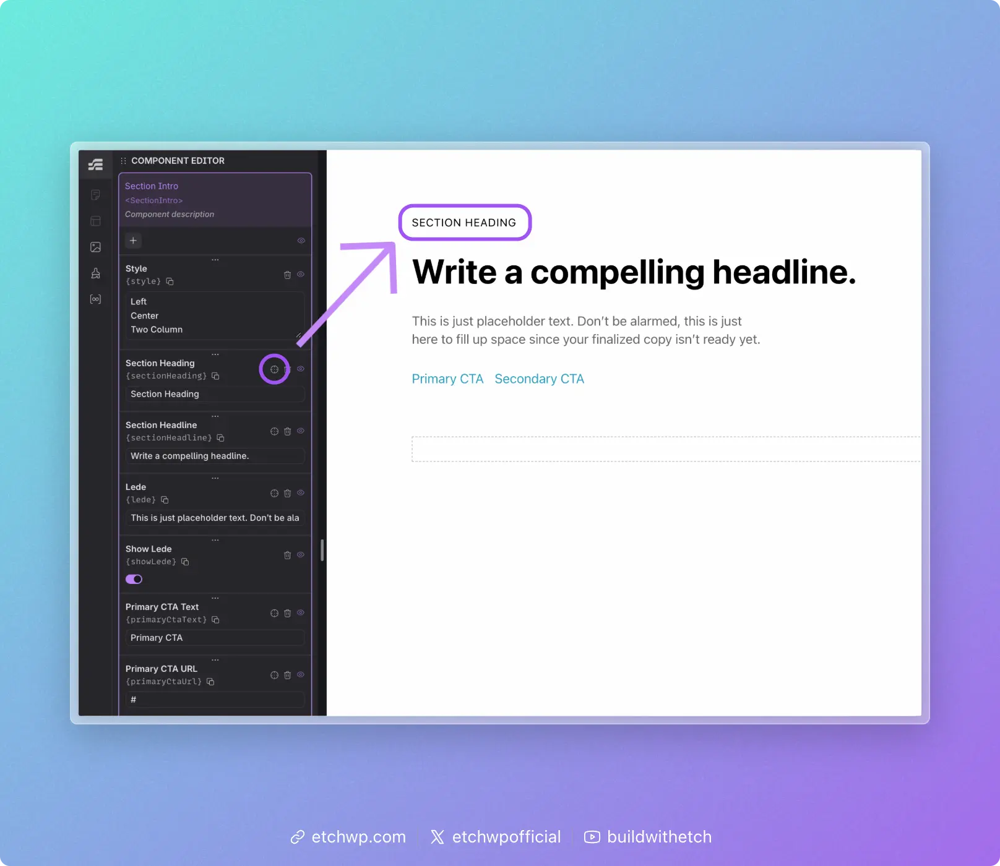
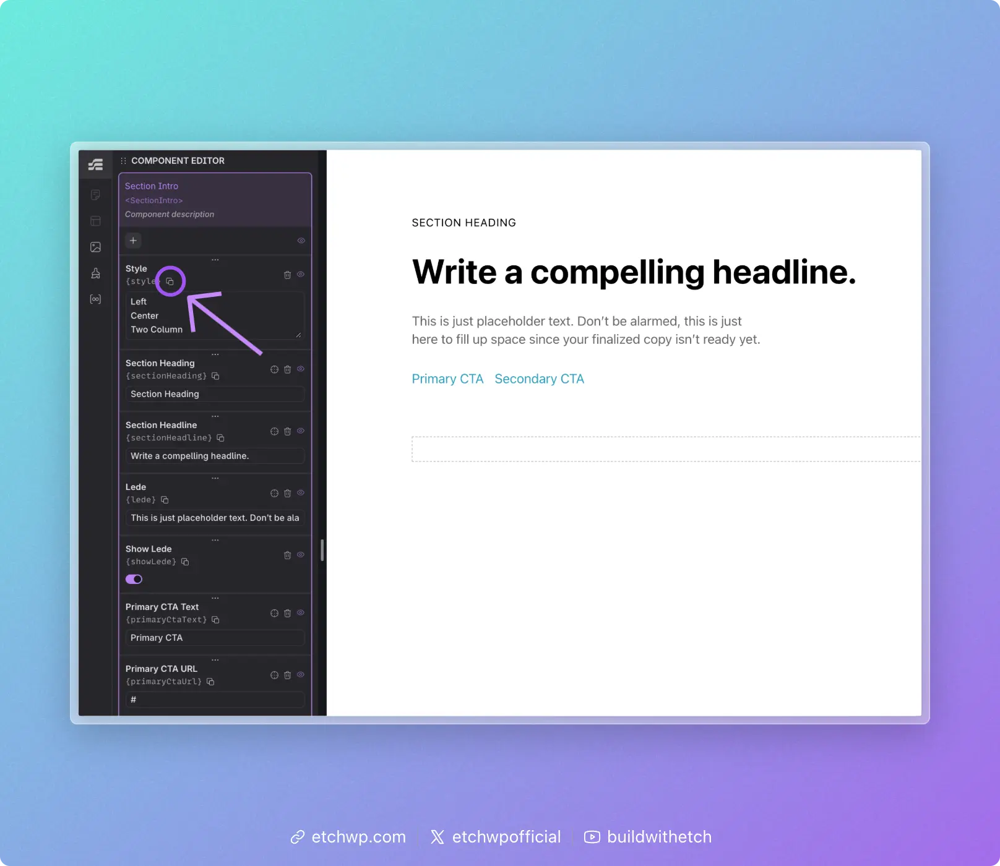

# Mapping Component Props

Once you've [created your props](./creating-component-props), the next step is to map them to the elements they control. Mapping is how you connect a prop to a specific part of your component so that it actually does something.

There are two methods for mapping props: **visual mapping** (fastest) and **copy & paste** (for attributes and code).

## Method 1: Visual Mapping (Target Icon)

The easiest way to map a prop is to use the target icon in the component editor.

1. Find the prop you want to map in the component editor panel
2. Click the **target icon** next to the prop



3. Click the element on the canvas that this prop should map to

The element's text content will be replaced with the prop reference (e.g., `{props.serviceName}`). You'll see this reflected immediately on the canvas.

This method works for anything that's visible and clickable on the canvas — text, headings, paragraphs, buttons, links, etc.

## Method 2: Copy & Paste

Some parts of a component can't be clicked on the canvas — things like `href`, `src`, `alt`, or custom attributes. For these, use the copy & paste method.

1. Click the **copy icon** next to the prop in the component editor
2. This copies the prop key to your clipboard (e.g., `props.serviceName`)
3. Paste it into the appropriate place — either in the **HTML editor** or the **attribute inputs panel**



### When to Use Braces

When you paste a prop key, you may or may not need to wrap it in curly braces `{}`. The rule is simple:

**Already inside braces?** Don't add more. If you're writing inside an existing expression like `{#loop ...}` or `{#if ...}`, just use the key as-is.

**Not inside braces?** Wrap it in curly braces to create an expression: `{props.propName}`.

**Examples:**

A text element displaying a prop value (not inside any braces):

```html
{props.heading}
```

A loop referencing a prop for its data source (already inside braces):

```html
{#loop props.items as item}
```

A conditional checking a boolean prop (already inside braces):

```html
{#if props.isFeatured}
```

An attribute value (not inside any braces):

```html
href="{props.linkUrl}"
```

## Coming Soon

In the future, Etch will include auto-suggest when mapping props, making the process even faster and more intuitive.

## Next Steps

Now that your props are mapped, you're ready to use your component:
- [Use a component with static data](./using-a-component-static)
- [Use a component with dynamic data](./using-a-component-dynamic)
