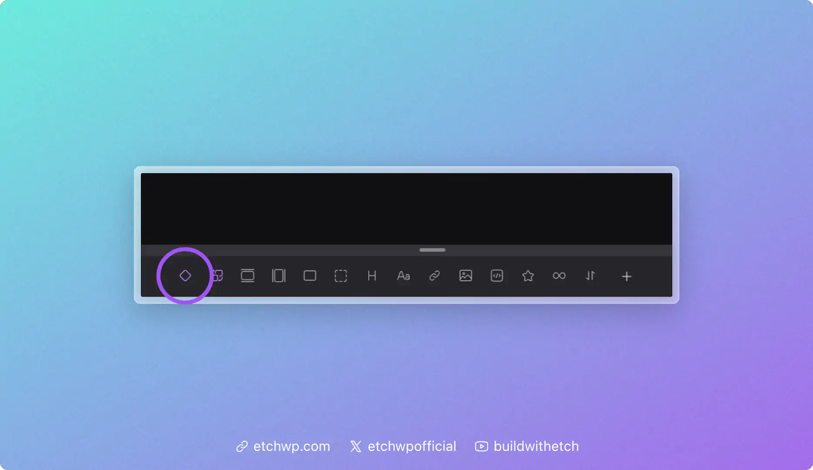
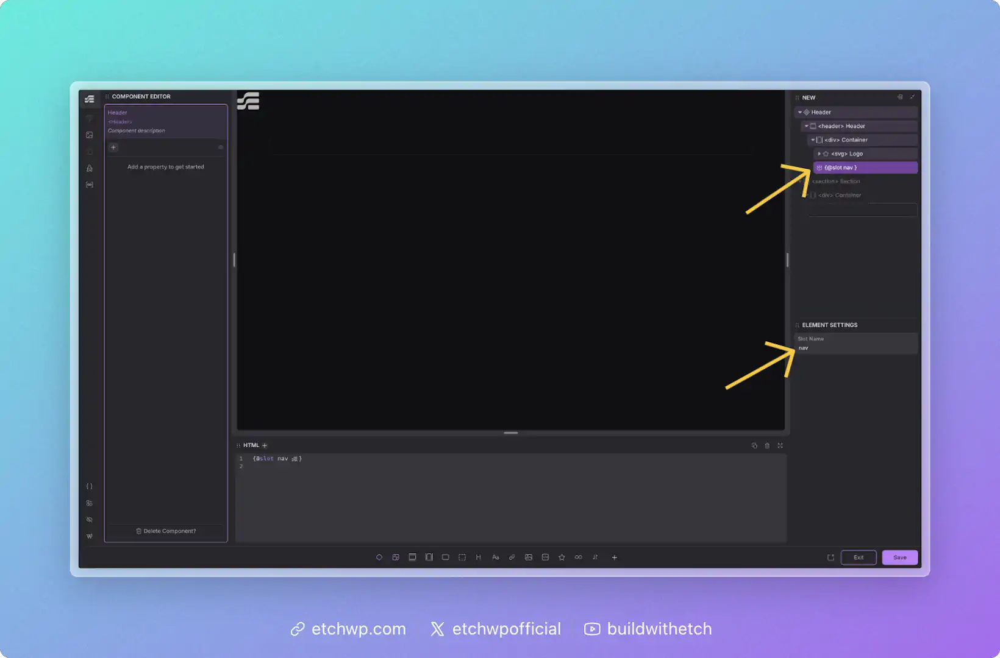
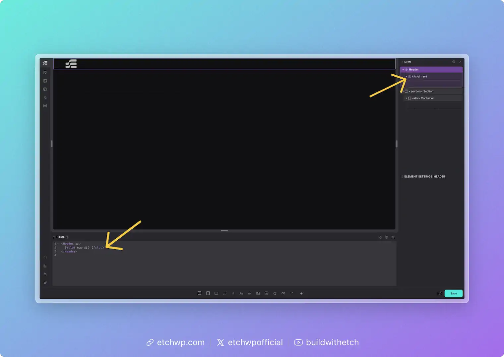
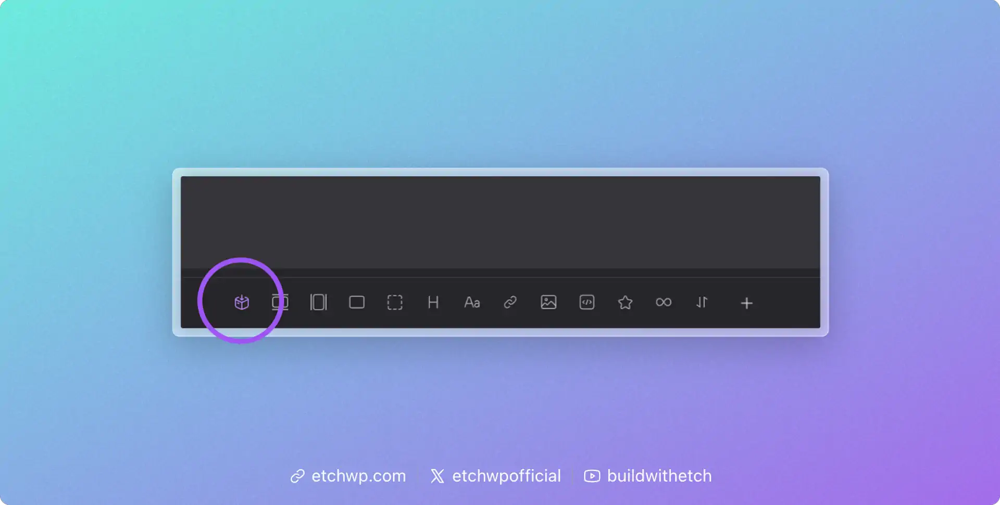

# Slots

Slots are an extremely powerful feature that add tremendous flexibility to your components.

You can think of a Slot as a "drop zone" in a component that can accept any content when the component is being used (on a per-instance basis). It effectively allows you to inject things into a component from the outside, without editing the component or affecting other instances.

This isn't just about adding flexibility for the sake of flexibility. In some cases, slots are mission critical to using components.

## A Practical Example for Slots

The easiest example to understand is an accordion component for Frequently Asked Questions.

The accordion heading is almost always just text, so you can easily use a text prop. This will allow us to write the "question" part of the FAQ.

What about the content of the accordion, though — the answer part of the FAQ? 

Should it be text? Should it be a combination of text and images? How much text? How many images? What if I want to include a link? What if I want to include a button? How do we determine what style of button? 

That's a lot of questions. And if we have to configure props and conditional logic for all the possibilities, that's going to be a tremendously complex component that still ends up with a lot of limitations.

Instead of programming all that complexity via props, all we have to do is define a slot in the accordion content area. Once the slot is defined, users can drop anything they want in the slot and be happy. 100% flexibility with zero complexity!

Without slots, the accordion component would be so limited that it would almost be useless. With slots, the accordion is suddenly a highly flexible and useful component.

## Defining a Slot

When you're in component editing mode, you'll see an icon in the Elements Bar for the Slot element. Click this icon to add a slot in your component. You'll see it show up in the structure panel as well as the HTML editor:

Once you've added a slot, you can name it by editing its label in the structure panel or editing its name in the attributes panel. It's helpful to use a contextual name so that anyone who uses the component knows what it's for.

You can also define your slot simply by writing `{@slot your-slot-name}` in the HTML editor. This will create your slot and name it at the same time.

## Using a Slot

When you add a component to the page, any defined slots will show up automatically.

If for some reason the slots don't show up when using your component, you'll see an icon in the Elements Bar for them. You can use this icon to add your slot so you can start adding content to it.

You can also add your slot simply by writing `{#slot your-slot-name}{/slot}` in the HTML editor.

:::note Don't Get it Twisted
A slot is an empty drop-zone that you define at the component level. This means each component instance will have a slot available for unique content. You should not try to add content to the slot from inside the component editor — slots are for adding content to each instance from *outside* the component editing context (e.g. the normal page development workflow).
:::

## FAQs about Slots

Can I define more than one slot?

Yep, there's no limit to how many slots a component can have.

What happens if nothing is added to a slot?

If nothing is added to a slot, Etch won't render anything on the front-end. There's no need for conditional logic — slot content is rendered and empty slots are not rendered. You'll never be left with empty wrappers.

What kind of content can I put in a slot?

There's no limitations on what can go inside a slot. 

Does content I put in slots apply to all instances of my components?

Nope. Slot content is per-instance. If you want something to apply to all instances of your component it should be hard-coded into your component and not placed in a slot.

Can I limit slots to specific types of content?

No, if you want to limit the user to placing certain types of content, then you should use existing prop types with conditional logic. Slots are specifically designed as generic drop zones.

Can slots have default starter content or fallback content?

Not yet, but we're planning on adding the ability to define default slot content or "fallback" content because we recognize the value and additional flexibility this would bring to components.

