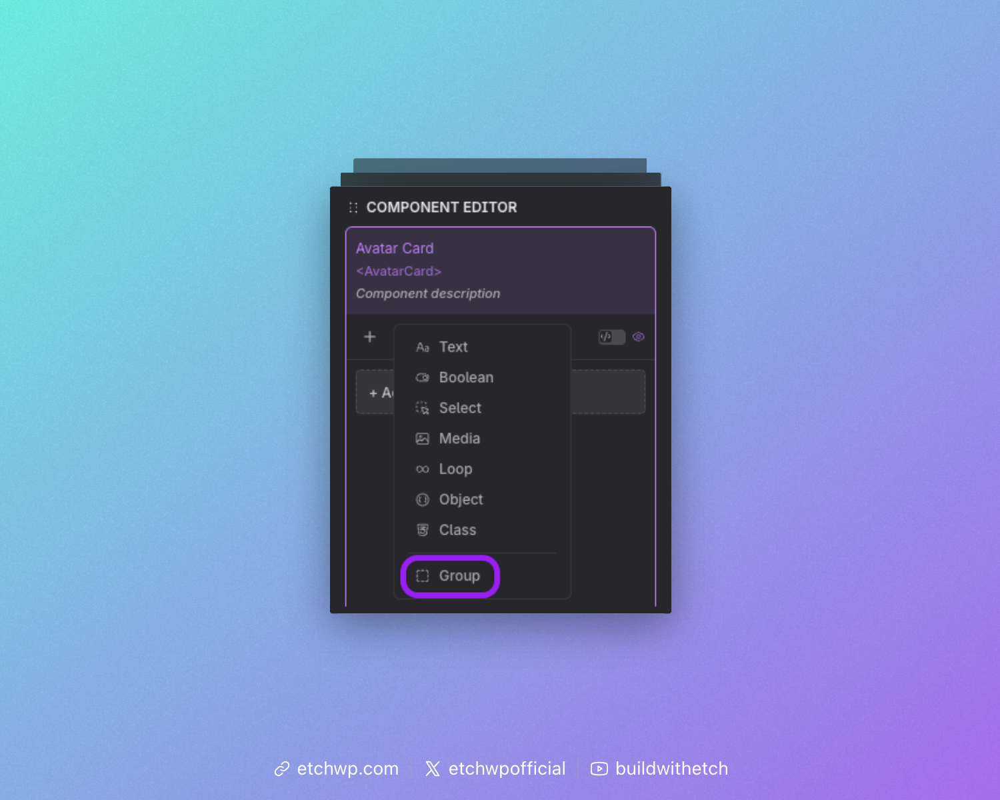

import VersionBadge from '@site/src/components/VersionBadge/VersionBadge';

# Group Prop

<VersionBadge version="1.4.0" />

The Group Prop lets you bundle multiple properties under a single key. This is useful when you want to organize related data together instead of managing many separate top-level props.

You can think of it like building a structured object (similar to JSON) inside your component.

## Adding a Group Prop

In the component editor, select **"Group"** from the props list.




## Defining the Group

After adding a Group Prop, you’ll need to:

- Set a **label** (for the UI)
- Set a **key** (used in your code)

The key is important because all nested props are accessed through it.

For example, if your group key is `hero`, you would access a nested prop like this: `{props.hero.tile}`


## Adding Props to the Group

Once your group is created, you can add properties inside it:

- **Drag** existing props into the group, or
- Use the **add button** to create new props directly inside the group

Every prop inside the group becomes part of the same structured object.


## Preview Data

The group automatically generates preview data from the default values of its nested props.

If you add a **Text Prop** called `title` with a default of `"Welcome Post"`, referencing {props.hero} gives you:

```json
{
  "title": "Welcome Post"
}
```

## Example: Hero Section

A Group Prop is a natural fit for a hero section. Rather than four separate top-level props (`title`, `description`, `image`, `buttonText`), you group them all under `hero`:

```json
{
  "title": "Welcome to our site",
  "description": "We build amazing things.",
  "image": "/hero.jpg",
  "buttonText": "Get Started"
}
```

```html
<h1>{props.hero.title}</h1>
<p>{props.hero.description}</p>

<button>{props.hero.buttonText}</button>
```

## Using the Group in Your Component

When your component is used, each nested prop appears as its own input, respecting its prop type, so users can edit all related values together in one place. The whole group is then available as a single structured object.

---

## Repeater Mode

<VersionBadge version="1.4.6" />

A Group Prop can be turned into a **Repeater**, allowing users to add multiple copies of the same group structure. Think of it as going from a single object to an array of objects.

### Enabling Repeater Mode

In the component editor, toggle the **Repeater** switch on any Group Prop. This converts the group from a single object into a repeatable list.

When Repeater mode is enabled, the prop type changes from `group` to `repeater`, and the data structure becomes an array of items, each item sharing the same sub-property definitions.

### Accessing Repeater Data in Your Template

Since the repeater produces an array, you iterate over it using `{#loop}`:

```html
{#loop props.features as item}
  <div>
    <h3>{item.title}</h3>
    <p>{item.description}</p>
  </div>
{/loop}
```

Each `item` gives you access to the sub-properties defined inside the group.

:::info
The repeater uses the same `{#loop}` syntax as any other loop in Etch. The prop key must be camelCased or use bracket notation:

**Correct:** `{#loop props.myFeatures as item}{/loop}`

**Correct:** `{#loop props['my-features'] as item}{/loop}`

**Incorrect:** `{#loop {props.myFeatures} as item}{/loop}` (extra brackets)
:::

### Example: Features List

A Repeater is a natural fit when your component needs a variable number of similar items. For example, a features section where each feature has a title, description, and icon:

**Component editor setup:**

1. Add a Group Prop with key `features`
2. Enable the **Repeater** toggle
3. Add sub-properties inside the group: `title` (Text), `description` (Text), `icon` (Media)

**Template:**

```html
<component>
  <section>
    <h2>Features</h2>
    <div class="features-grid">
      {#loop props.features as feature}
        <div class="feature-card">
          
          <h3>{feature.title}</h3>
          <p>{feature.description}</p>
        </div>
      {/loop}
    </div>
  </section>
</component>
```

**Resolved data (example with 2 items):**

```json
[
  {
    "title": "Fast",
    "description": "Lightning-fast performance.",
    "icon": "/fast.svg"
  },
  {
    "title": "Secure",
    "description": "Built with security in mind.",
    "icon": "/secure.svg"
  }
]
```

### Using Repeater Data in the Instance Panel

When a component with a Repeater Prop is used on a page, the instance panel shows:

- Each item as a collapsible section (Item 1, Item 2, etc.)
- An **Add** button to create new items
- A **Delete** button on each item to remove it

Users can add as many items as they need, and each item provides inputs for all the sub-properties defined in the group.

### Combining Repeater with Other Props

Repeaters work alongside regular props. For example, a testimonials component might combine a Text Prop for the section heading with a Repeater for the testimonial items:

```html
<component>
  <section>
    <h2>{props.heading}</h2>
    {#loop props.testimonials as testimonial}
      <blockquote>
        <p>{testimonial.quote}</p>
        <cite>{testimonial.author}</cite>
      </blockquote>
    {/loop}
  </section>
</component>
```

### Nested Groups Inside Repeaters

You can nest a Group Prop inside a Repeater to create more complex data structures. For example, each repeater item could contain a group of social links:

```html
{#loop props.teamMembers as member}
  <div>
    <h3>{member.name}</h3>
    <a href="{member.social.twitter}">Twitter</a>
    <a href="{member.social.linkedin}">LinkedIn</a>
  </div>
{/loop}
```
