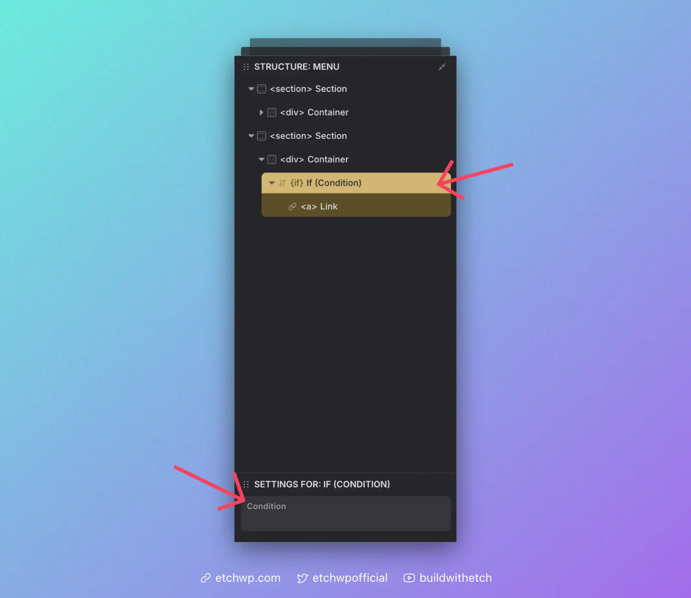

# Basic Conditions

The simplest conditions to start with are simple single condition `if` statements.

All you have to remember is that you're programming logic to _**show**_ the elements inside the condition. Of course, if that condition doesn't resolve to showing the element, then the element is effectively hidden.

The process is simple. Ask yourself two questions:

1. What data do I want to check?
2. Should I write the statement as positive or negative to show the element?

One of the simplest conditions is based on showing a `logout` link if the user is logged in, and a `login` link if the user is logged out. Doing this as an exercise will help you understand exactly how simple `if` conditions work.

Let's ask ourselves the two questions:

- **What data do I want to check?**: In this case, we want to check the [Dynamic Data Key](/dynamic-data/dynamic-data-keys), `user.loggedIn`.
- **Should I write the statement as positive or negative to show the element?**: In this case, we want to write it as a positive to show the logout link and as a negative to show the login link.

## Conditional Logic With the UI

Add a condition element to the page by clicking the Condition Element icon:


You'll see the condition element in the structure panel. Add a link element inside of it.

When you click the condition element in the structure panel, you'll also see an exposed Attribute panel for it. It looks like this:



When using the UI like this, you have to remember that the `{#if}` was already written for you. So all you're doing is checking the data.

And since conditions are blocks in the editor, you are free to drag whatever elements you want into either condition. It's very flexible. You don't need one condition per element – a single condition can control an entire collection of elements.

## Boolean Conditions

Boolean conditions evaluate to true/false directly (e.g., `user.loggedIn`). These are the simplest and most common checks. Use them whenever you can keep your logic as a straightforward yes/no.

### Practical Examples

#### Check if user is logged in
Write the boolean key directly. You don't need to compare to `true`.

```html
{#if user.loggedIn}
  <!-- Show logout link -->
{/if}
```

#### Check if user is NOT logged in
Prefix the key with `!` to invert the boolean.

```html
{#if !user.loggedIn}
  <!-- Show login link -->
{/if}
```

#### Check if a post has a specific category
You can also use data modifiers in conditions. For example, you can check a post's assigned category terms without the need for looping by combining [.pluck()](/dynamic-data/dynamic-data-modifiers/basic-modfiers#pluck) and [.includes()](/dynamic-data/dynamic-data-modifiers/comparison-modifiers#includes).

```html
{#if this.categories.pluck("name").includes("ABCs")}
  <!-- Render content only if post has the ABCs category -->
{/if}
```

## Non-Boolean Conditions

If you need to check a specific value, like the value of a custom field, then you will use comparison operators. In most cases, you should use strict comparisons (`===`, `!==`) which compare both the value and the type.

```html
{#if props.productCategory === "featured"}
  <!-- Show featured tag -->
{/if}
```

For more information about the difference between loose and strict comparisons, see the [Advanced Conditions](/conditional-logic/advanced-conditions#loose-vs-strict-comparisons) guide.

### Practical Examples

#### Star rating with strict comparisons

For this example, let's say you're creating a star rating component. We'll keep it simple and say the rating can be whole numbers from 1 to 5.

In your component, create a prop called "rating." This is where we'll place the number and this is the prop we'll check the value of in the condition.

One way to do this would be to create five conditions that all check the rating value. If the rating equals 1, show one star. If the rating equals 2, show two stars.

```html
{#if props.rating === 1}
  <!-- Star 1 -->
{/if}
{#if props.rating === 2}
  <!-- Star 1 --> <!-- Star 2 -->
{/if}
{#if props.rating === 3}
  <!-- Star 1 --> <!-- Star 2 --> <!-- Star 3 -->
{/if}
```

This approach uses strict comparison (`===`), which is recommended for most cases. It ensures that `props.rating` is exactly the number we're checking for.

## Values vs Strings

Let's continue with the above example, but tackle it with a more efficient (requires fewer star elements) and flexible (since it supports decimal values) approach.

For this approach, we'll check the actual numerical value of the rating using mathematical operators (`>`, `<`, `>=`, `<=`):

```html
{#if props.rating >= 1}
  <!-- Star -->
{/if}
{#if props.rating >= 2}
  <!-- Star -->
{/if}
{#if props.rating >= 3}
  <!-- Star -->
{/if}
{#if props.rating >= 4}
  <!-- Star -->
{/if}
{#if props.rating >= 5}
  <!-- Star -->
{/if}
```

There are two very important and distinct differences you need to understand:

1. We're checking a VALUE (math) instead of a STRING (text).
2. This is denoted by removing the quotations around the value.

Look closely:

`{#if props.rating === "2"}` says, "Show the element if the value of `props.rating` literally says "2".

But when you write `{#if props.rating >= 2}`, Etch can actually calculate the value and see if the condition is true, because it knows that 2 is equal to 2. And the condition that comes before it, `{#if props.rating >= 1}` will also be true because Etch knows that 2 is greater than 1.

You would never write `{#if props.rating >= "2"}` because "greater or equal" is irrelevant when examining a string of text. Again, putting the quotes around the number tell Etch that you want to examine "2" as a string, and not a numerical value.

That's a critical distinction that many beginners get wrong.

## Best Practices

1. **Use strict comparisons (`===`, `!==`) by default** to avoid unexpected behavior
2. **Always use quotes around text values** and never around numbers or booleans
3. **Use mathematical operators (`>=`, `<=`, `>`, `<`) for numerical ranges**
4. **For more complex conditions**, refer to the [Advanced Conditions](/conditional-logic/advanced-conditions) guide

:::tip
When using `{#if}` statements, remember they are block-level conditions that wrap elements. If you need an inline conditional (for example, inside an attribute value like a `class`), use [Comparison Modifiers](/dynamic-data/dynamic-data-modifiers/comparison-modifiers) instead.
:::

## Practice Makes Perfect

The first step to learning how to use conditions is to not be afraid of them.

Conditional logic is a critical piece of advanced web development and personalized web experiences. Once you've used them a few times, you'll quickly get comfortable. And once you get comfortable, things get really fun!

As always, if you get stuck, don't hesitate to ask for help in the [Etch Community](https://community.etchwp.com).