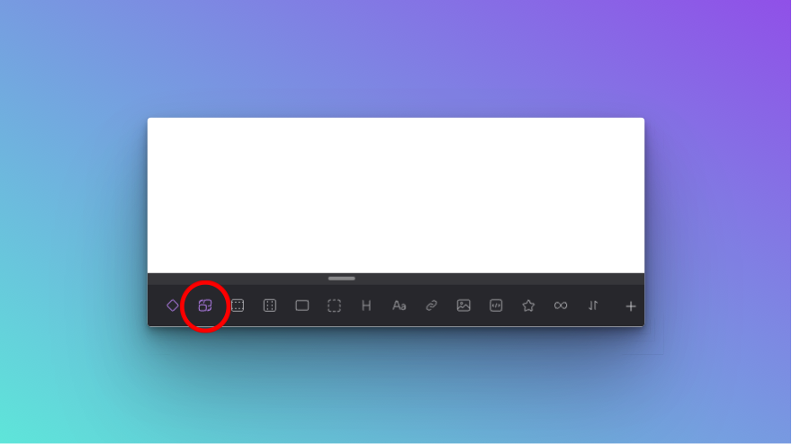
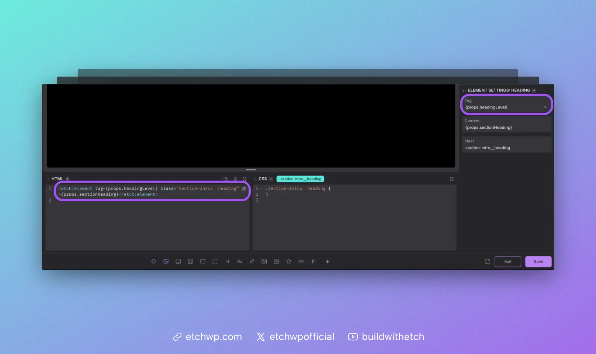

import VersionBadge from '@site/src/components/VersionBadge/VersionBadge';

# The Element Element

<VersionBadge version="1.0.0-alpha-3" />

The **Element Element** (so meta!) in Etch is a special element that allows you to dynamically change the tag of an element with a select input or prop while avoiding a dependency on conditional logic.

## Adding the Element Element

There are two ways to add the Element Element:

1. You can click the icon for it when editing a component.
2. You can write it manually in the HTML editor.

:::note
Since the Element Element is most useful when working with components, we've only added it to the Elements Bar in component editing mode. 
:::

### Adding the Element Element in the Component Editor



When editing a component, you'll see an icon that looks like two elements swapping places. Click this icon to add the Element Element to your component.

### Adding the Element Element in the Code Editor'

Even though the icon for the Element Element only shows up in the component editor, the element will function anywhere and can be used anywhere. You just have to write it manually to create it, since it's not a commonly used element outside of components.

You can add the Element Element via the code editor any time by writing `<etch:element>`.

## Using the Element Element



Once you've added the Element Element to the page, you'll see a Tag input in the attributes panel. This is where you control the output of the element's tag.

It's important to understand that this input is a Combobox. It has a dropdown of commonly used tags, but the input accepts any custom value. 

Whatever value you put in the tag attribute will be what the Element Element morphs into on the front end.

:::note
This input simply adds a `tag` attribute to the Element Element, like this: `<etch:element tag="div">`. You could write this manually in the HTML instad of using the input in the attributes panel if you'd like.
:::

## Changing the Tag Dynamically

The Element Element's tag attribute accepts dynamic data. This is the primary use case, giving you the ability to change an element's tag from a component prop or custom field.

For example, let's say you're building a Section Intro component. You want to be able to use this component in Hero Sections as well as any other random section on your website.

In the Hero context, the heading in your intro would need to be an `h1`. In all other contexts, the heading will need to be an `h2`.

In the past, you would have to duplicate the heading element, make the first one an `h1` and the duplicate an `h2`. Then you'd use conditional logic to swap between them.

Using conditional logic any time you need to be able to change an element's tag is extremely messy, tedious, and overly complex.

The Element Element avoids all that. Simply create a prop or custom field like "Heading Level" and then inject it into the Element Element.

```HTML
<etch:element tag={props.headingLevel}
```

In this situation, you could create a Select Prop that let's the user choose from `h1` and `h2`, which gives the benefit of limiting the input to only what's correct for a Section Intro component.

Now you've created a Section Intro component with a dynamic heading tag without a single line of conditional logic.