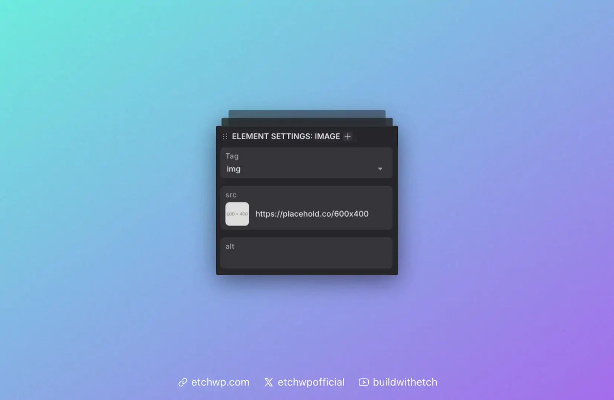
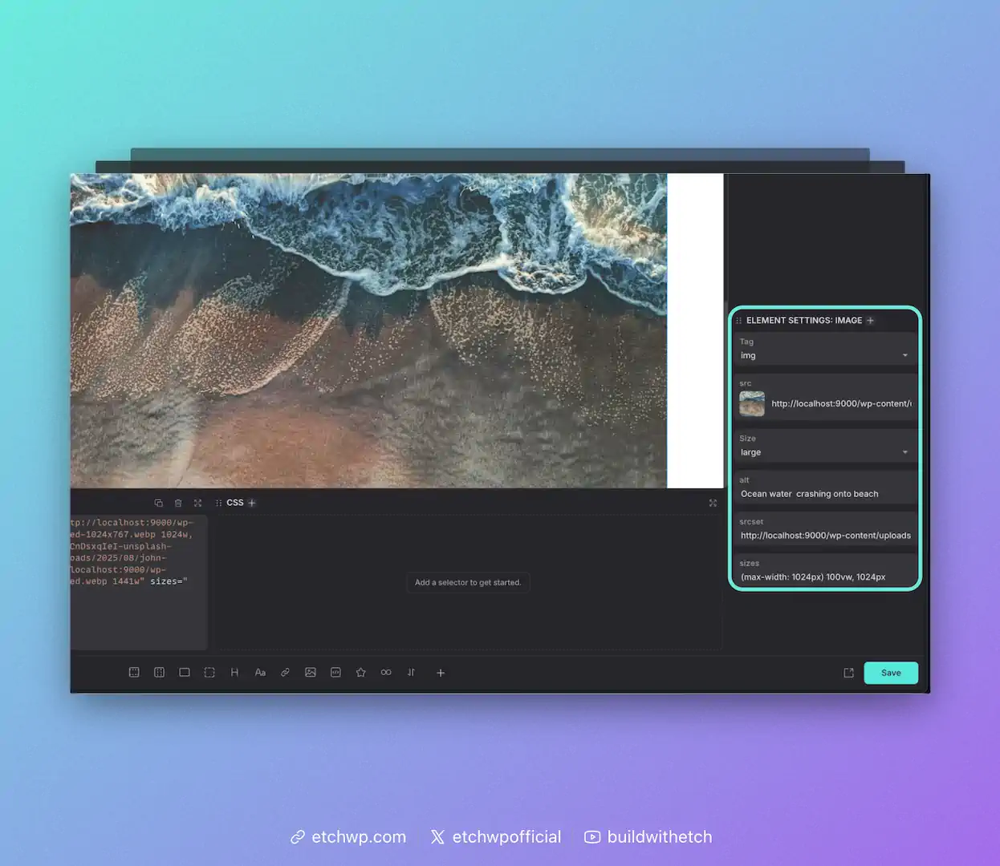

# Image

The Image element creates a standard HTML image tag with the `src` and `alt` attributes automatically added. You can edit the `src` and `alt` via the HTML editor, the Attributes Panel, or the Add Attribute Bar.


Example output:

```html

```

## Essential Attributes & Selecting an Image

You can click on the thumbnail in the image attributes panel to to open the media library and choose an image. This will replace the `src` attribute with the path to the new image.



### `src`
The `src` attribute is mandatory and contains the URL or path to the image file. This is automatically added with a placeholder path when you add an Image element to the canvas.

### `alt`
The `alt` attribute provides alternative text for screen readers and accessibility. It's crucial for web accessibility and should describe the image content.

```html

```

## Responsive Images with `srcset`

The Image element supports the `srcset` attribute for responsive images, allowing you to provide an optimal image size as well as various additional files for different screen sizes and resolutions. This is all handled for you automatically by Etch and WordPress.

:::info
`srcset` works by providing various image resolutions to the browser so the browser can choose which resolution to load based on the user's device. The use of `srcset` brings major performance increases without any effort on your part. 
:::

Once you choose an image, more attributes will appear:



### `size`
Use this attribute to select the optimal size for the image in its current context on the canvas. The size options are automatically pulled from your registered size options in WordPress.

### `srcset`
You can ignore this attribute. There's nothing you have to do here—it's all done for you.

### `sizes`
You can ignore this attribute. There's nothing you have to do here—it's all done for you.

### Registering Custom Image Sizes in WordPress

WordPress only offers a few sizes by default. If you want to create more of them, you can use the example script below. Add it to your site's `functions.php` file.

```php
<?php
add_theme_support("post-thumbnails");
add_image_size( 'image-480', 480, 9999 );
add_image_size( 'image-640', 640, 9999 );
add_image_size( 'image-720', 720, 9999 );
add_image_size( 'image-960', 960, 9999 );
add_image_size( 'image-1168', 1168, 9999 );
add_image_size( 'image-1440', 1440, 9999 );
add_image_size( 'image-1920', 1920, 9999 );

function my_custom_sizes( $sizes ) {
	return array_merge( $sizes, array(
		'image-480' => 'image-480',
		'image-640' => 'image-640',
		'image-720' => 'image-720',
		'image-960' => 'image-960',
		'image-1168' => 'image-1168',
		'image-1440' => 'image-1440',
		'image-1920' => 'image-1920',
	) );
}
add_filter( 'image_size_names_choose', 'my_custom_sizes' );
```

:::warning
Note: You will need to regenerate thumbnails to regenerate all the images in your media gallery at the various sizes before you're able to use the new sizes. There are various free plugins in the WordPress.org repo that regenerate thumbnails.
:::

## Additional Attributes

You can add any additional attributes you'd like, such as:

### `loading`
Control when the image loads:

```html
<!-- Lazy load (default for images below the fold) -->


<!-- Eager load (for above-the-fold images) -->

```

### `decoding`
Control image decoding:

```html
<!-- Async decoding (default) -->


<!-- Sync decoding (for critical images) -->

```

## Working with Dynamic Data

Rather than statically referencing a source, you can insert a dynamic data key as the src. For example, if you're looping through items, you can dynamically reference the post's Featured Image:

```html

```

All attributes support dynamic data.

Read more about [Dynamic Data Keys](../../dynamic-data/dynamic-data-keys).

## Wrapping Images with a Figure Element

To wrap an image in a `figure` tag, you can right click the image and choose "wrap with div" from the context menu. Once this action occurs, simply change the `div` to `figure`. You can also add a `figcaption` element inside the figure if you'd like. To do this, just add text inside the figure element and change the tag from `p` to `figcaption`.

We're considering making this process more automatic in the future.