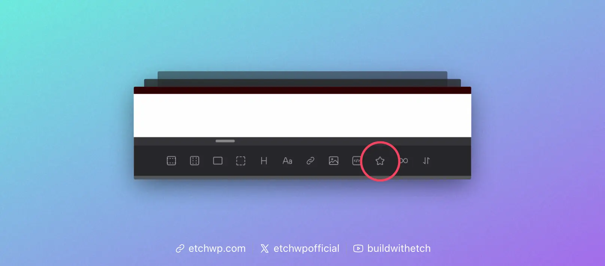
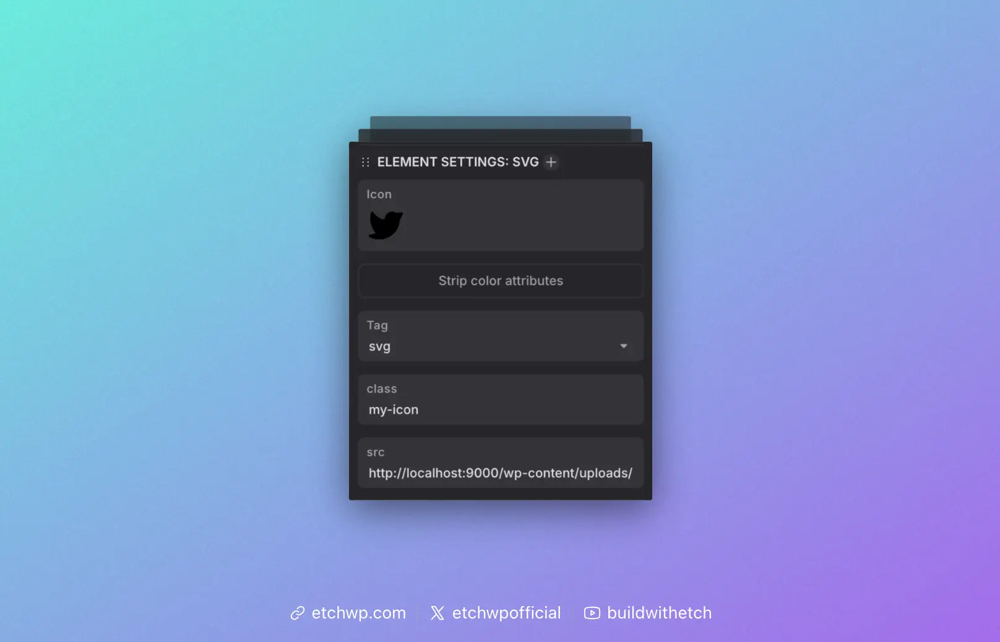

# SVG

The SVG Element in Etch is a special element that handles SVGs dynamically. It's the default/recommended way of inserting SVGs in Etch and is compatible with component props as well.

:::info
Etch has native support for SVG HTML, but this is separate from Etch's SVG element. If you want to paste SVG code into Etch, you're always free to do that. The SVG Element is an alternative special element that handles SVGs dynamically.
:::

 To get started, add the SVG element to the page by clicking the SVG element in the Elements Bar.

In the code editor you will see `<etch:svg />`, but the output on the front-end will be the raw SVG code.

In the Attributes Panel, with the SVG Element selected, you can choose a source (media library) or enter a URL in the `src` attribute field:

It's important to note that the `src` attribute accepts any valid URL to an SVG file, even external URLs to 3rd party icon libraries.

## Using SVGs With Components

The SVG element can be used in components via the Image prop.

For example, create an Image prop called "Icon" and then place `{props.icon}` (or whatever your prop key is) in the `src` field for the SVG.

You now have an editable icon for your component with support for media picking or a custom URL.

## Stripping Colors

Many SVGs have hardcoded color values. We've added a feature called "Strip Colors" to the SVG element which will add `stripColors="true"` to your SVG.

This feature will convert hardcoded colors to currentColor, allowing you to change icon colors with basic CSS, via a class or other valid selector. It will also inherit the color property from any parent.

## Selector Support

The SVG element is compatible with any valid CSS selector.