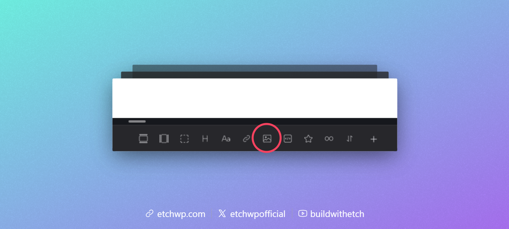
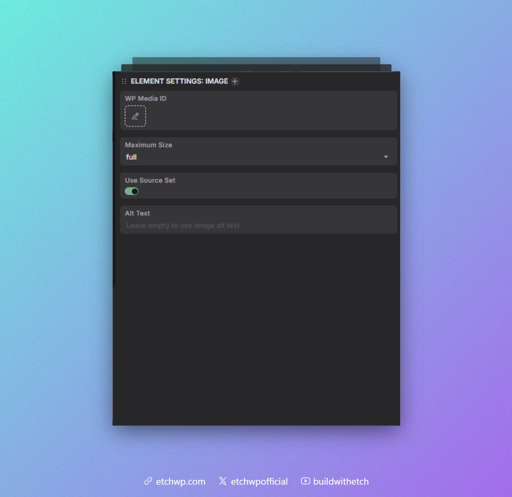

import VersionBadge from '@site/src/components/VersionBadge/VersionBadge'

# Dynamic Image

<VersionBadge version="1.0.0-beta-14" />

The Dynamic Image Element in Etch is a special element that handles WordPress images dynamically. It's the default/recommended way of inserting images in Etch for WordPress and is compatible with component props as well.

:::info
Etch has native support for IMG HTML, but this is separate from Etch's Dynamic Image element. If you want to use a `` tag in Etch, you're always free to do that. The Dynamic Image Element is an alternative special element designed specifically to handle WordPress images by their ID.
:::

To get started, add the Dynamic Image element to the page by clicking the Dynamic Image element in the Elements Bar.

In the code editor you will see `<etch:img />`, but the output on the front-end will be the image with a few additional attributes.

In the Attributes Panel, with the Dynamic Image Element selected, you can choose a source (media library) or manually enter a Wordpress Media ID.

On the front-end, the image will be rendered with the appropriate `alt`, `src`, `srcset`, and `sizes` attributes for optimal performance.

The `alt` attribute will be populated from the media library, but can be overridden by setting a custom `alt` attribute.

You can also choose a specific maximum image size by choosing from the `Maximum Size` dropdown in the Attributes Panel, or use the `maximumSize` attribute to set a custom size.

If you do not want to use `srcset` and `sizes`, you can disable this feature by toggling off the `Use SRCSET` option in the Attributes Panel, or set the `useSrcSet` attribute to `false`.

## Using Dynamic Images With Components

Since the Dynamic Image element just needs a media id to render an image, it works perfectly with component props. Just pass the media id via the media prop, or the text prop. This of course also works with dynamic data sources.

For example, if you want to create a gallery, you can loop over an array of media ids and pass each id to the Dynamic Image element inside the loop.

## Other attributes

Any attribute set on the Dynamic image element will be passed through to the rendered `` tag, except for the special attributes like `src`, `maximumSize`, and `useSrcSet`, which won't be rendered on the final `` tag.

If you set a custom `alt` attribute, it will override the default alt text from the media library.
