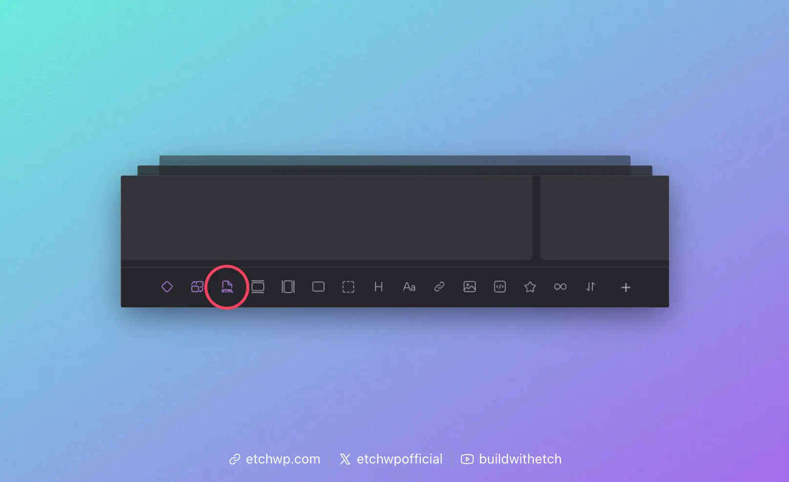

# The HTML Element

The HTML Element accepts and parses raw HTML. Since Etch already has a native HTML editor that allows raw HTML, this might seem redundant. It's necessary, though, for one specific reason.

The HTML Element is used in dynamic data situations (e.g. component/template authoring) where you're pulling content from the database or a component prop that contains HTML (a rich text field, for example).

## Adding the HTML Element

There are two ways to add the HTML Element:

1. You can click the icon for it when editing a component or a template.
2. You can write it manually in the HTML editor.

:::note
Since the HTML Element is most useful when working with components and templates, we've only added it to the Elements Bar in these contexts.
:::

### Adding the HTML Element in the Component Editor



When editing a component or template, you'll see a purple HTML element icon. Click this icon to add the HTML Element to your component.

### Adding the HTML Element in the Code Editor'

Even though the icon for the HTML Element only shows up in the component editor, the element will function anywhere and can be used anywhere. You just have to write it manually to create it, since it's not a commonly used element outside of components/templates.

You can add the HTML Element via the code editor any time by writing `<etch:html />`. 

:::info The HTML Element is Self-Closing
Note that the HTML element is a self-closing element. Write it like `<etch:html />` and not `<etch:html>foo</etch:html>`.
:::

## Using the HTML Element

The HTML Element has two attributes:

- **content**: This is where you put the dynamic data or prop key.
- **unsafe**: Boolean attribute that accepts `true` or `false`. The default is `false`.

### The `unsafe` Attribute

When `unsafe="false"` (the default), the HTML is sanitized but still allows "safe" tags commonly used in rich content. This includes tags like `<p>`, `<strong>`, `<em>`, `<b>`, `<u>`, `<a>`, `<ul>`, `<ol>`, `<li>`, `<blockquote>`, and more. Technically, it allows any HTML that WordPress permits in post content (via `wp_kses_allowed_html('post')`).

When `unsafe="true"`, no sanitization occurs. All HTML passes through, including potentially dangerous tags like `<script>` and `<iframe>`.

**In most cases, `unsafe="false"` is what you want.** If you're rendering rich content from dynamic data (like a WYSIWYG field), the default setting will display your formatting while keeping things secure.

:::danger Security Alert
Setting the `unsafe` attribute to `true` has major security implications. It should be reserved for very specific edge cases where you need to render scripts or iframes. Only use this if you fully trust the source of the HTML content and understand the XSS risks involved.
:::

Here's an example of the final string:

```html
<etch:html content={item.your-rich-text} unsafe="false" />
```

Note: The `unsafe` attribute is optional.