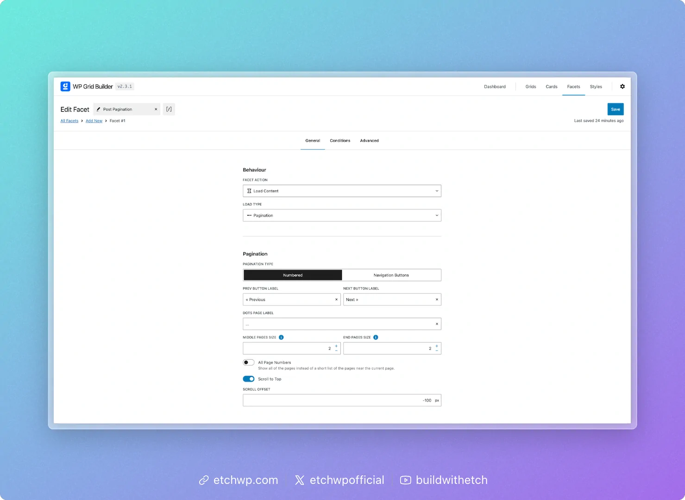

# WP Grid Builder

This doc covers how to use WP Grid Builder (WPGB) facets with Etch. It provides a generic workflow that applies to all facet types. We'll use Pagination as an example for you to follow along.


## Quick start

1. Create or configure a facet in WP Grid Builder.
2. In your Etch loop’s query args, set `wp_grid_builder` to a selector in the form `wpgb-content-{your_selector}` (example: `wpgb-content-posts`).
3. Add the same selector as a CSS class on the direct parent of your loop element.
4. Use the same selector in the facet shortcode’s `grid` attribute where you want the controls to appear.

That’s it. The selector links the facet to your loop and WPGB handles updating the loop via AJAX.

## Prerequisites

- WP Grid Builder plugin installed and facets created as needed.
- An Etch loop configured for the content you want to filter/paginate.
- A unique selector value for each loop you want to control, which must be prefixed with `wpgb-content-`, and the exact same value must be used in all three places: the query arg, the CSS class, and the shortcode `grid` attribute. It could be any string after the prefix, such as `wpgb-content-posts`, `wpgb-content-archive`, or `wpgb-content-blog`.

## Setup steps

### 1) Create a facet in WPGB

- Go to WP Grid Builder → All Facets → Add New.
- Configure the facet’s type and options as needed.

### 2) Connect the facet to your Etch loop

In your loop’s query args, add an arg for `'wp_grid_builder' => 'wpgb-content-{your_selector}'`

```php
$query_args = [
  'post_type' => 'post',
  'posts_per_page' => $posts_per_page ?? 12,
  'post_status' => 'publish',
  'orderby' => 'date',
  'order' => 'DESC',
  'wp_grid_builder' => 'wpgb-content-1'
];
```

In your template, add the same value as a CSS class on the direct parent of your loop element:

```html
<div class="results wpgb-content-1">
  {#loop your-loop-name as item}
    <!-- loop content -->
  {/loop}
</div>
```
:::tip
**Important:** The selector can be anything you choose, but it must be prefixed with `wpgb-content-` and must match exactly across the query arg (`wp_grid_builder`), the CSS class, and the shortcode `grid` attribute. For example, if you use `wpgb-content-posts`, make sure to use `wpgb-content-posts` in all three places: the query arg, the CSS class, and the facet shortcode's `grid` attribute.
:::

### 3) Output the facet UI

- Copy the facet’s shortcode from WPGB (in All Facets, open the item menu → Shortcode) and paste it where you want the controls to render. Add the `grid` attribute to match the selector value you used above (`wpgb-content-{your_selector}`).

```html
[wpgb_facet id="{your_facet_id}" grid="wpgb-content-{your_selector}"]
```

## Concrete example: Pagination facet

Pagination in WPGB is configured as a Load Content facet with a Pagination load type.

1) In WPGB, create a facet:
- Facet Action: Load Content
- Load Type: Pagination
- Optional: enable Scroll to Top
- Set the Facet Slug and save



2) Configure your Etch loop args (example):

```php
$query_args = [
  'post_type' => 'post',
  'posts_per_page' => 10,
  'order' => 'DESC',
  'wp_grid_builder' => 'wpgb-content-1'
];
```

3) Add the selector class to the parent of the loop element and place the shortcode below it:

```html
<section data-etch-element="container">
  <div class="posts-grid wpgb-content-1">
    {#loop blog-posts as item}
      <article>
        {#if item.featuredImage}
          
        {/if}
        <h2><a href="{item.permalink.relative}">{item.title}</a></h2>
        <p>{item.excerpt}</p>
      </article>
    {/loop}
  </div>

  [wpgb_facet id="your-facet-id" grid="wpgb-content-1"]
</section>
```

When users interact with the pagination controls, WPGB updates the loop content via AJAX and maintains URL state with the Facet Slug.

## Using other facet types

The same connection pattern applies to most facet types (search, filters, sorting, reset):

- Create/configure the facet in WPGB.
- Ensure your Etch loop has a `wp_grid_builder` selector value.
- Add that class to the loop element's parent.
- Output each facet’s shortcode near the loop.

You can render multiple facets for the same loop; just make sure they all target the same selector value. If you have multiple independent loops on a page, give each loop a unique `wpgb-content-*` value and use separate facets/shortcodes per loop.


## Multiple loops with their own facets

WP Grid Builder supports multiple loops on the same page, each with their own facets. Each loop should have its own unique `wpgb-content-*` selector value, and all three components (query arg, CSS class, shortcode grid attribute) must use the same value for that loop to work correctly.


## Tips and best practices

- Use a clear naming convention for selector classes, e.g., `wpgb-content-posts`, `wpgb-content-products`.
- Place the selector class on the direct parent element of the loop element (not the loop itself).
- Keep `posts_per_page` (or your query limit) finite; pagination will be derived from this value.
- Group your facet UI near the loop so users can easily discover controls.
- Test with multiple facets active to ensure the URL state and interactions behave as expected.

## Troubleshooting

- Facet not affecting the loop: Verify the `wp_grid_builder` value matches the class on the loop element's parent exactly.
- Wrong content updating: Ensure each loop/facet group uses a unique selector value.
- No pagination: Confirm the loop has a finite `posts_per_page` and the facet is set to Load Content → Pagination.
- Shortcode issues: Re-copy the shortcode from WPGB and ensure the `grid` attribute matches your `wpgb-content-*` selector value (e.g., `wpgb-content-posts`).

## References

WP Grid Builder guide: Filter custom queries: https://docs.wpgridbuilder.com/resources/guide-filter-custom-queries/