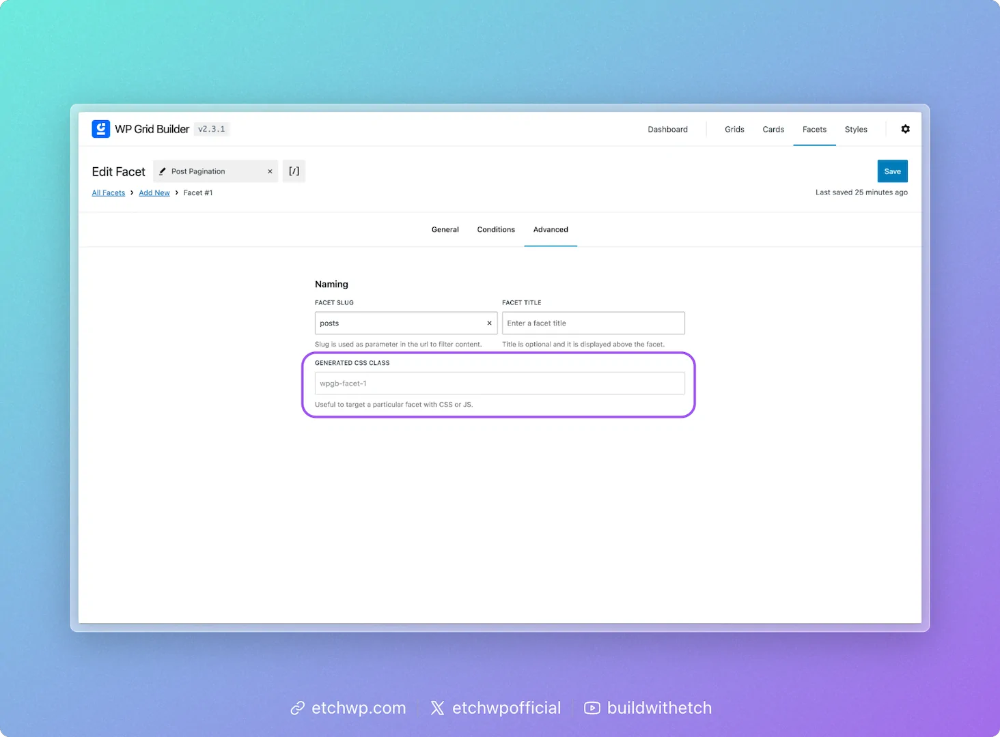
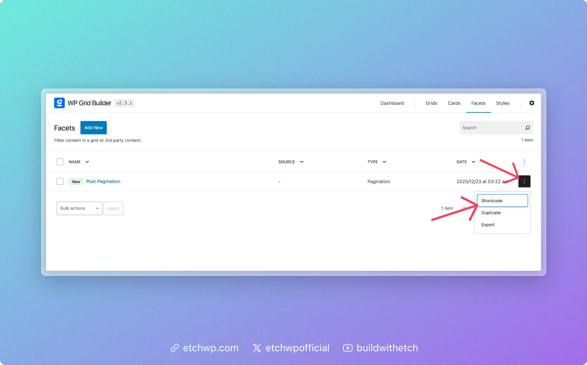

# Pagination

WP Grid Builder's pagination facet allows you to add pagination controls to your Etch loops, enabling users to navigate through multiple pages of content. This integration works seamlessly with Etch loops by connecting the pagination facet to your loop's container.

## Overview

The pagination facet from WP Grid Builder provides a way to paginate content displayed in Etch loops. When configured correctly, clicking pagination controls will dynamically update the loop content without a full page reload, providing a smooth user experience.

## Setup Instructions

### Step 1: Create the Pagination Facet

1. Navigate to **WP Grid Builder > All Facets > Add New**
2. Name your facet (e.g., "Post Pagination" or whatever content you're paginating)
3. Choose **"Load Content"** in the **Facet Action** dropdown
4. Set **Load Type** to **"Pagination"**
5. Enable **"Scroll to Top"** (optional but recommended for better UX)


6. Click the **Advanced** tab
7. Set the **Facet Slug** (e.g., "posts" or whatever you prefer - this will be used in the URL for pagination)
8. **Important**: Take note of the **Generated CSS Class** for your facet (shown in the "Generated CSS Class" box). You'll need this in the next steps.



9. Click **Save**

:::tip
The Generated CSS Class is typically something like `wpgb-content-1`, `wpgb-content-2`, etc. This identifier is crucial for connecting the facet to your loop.
:::

### Step 2: Configure Your Etch Loop

1. Edit or create your loop in Etch's Loop Manager
2. Configure your loop however you'd like (post type, posts per page, ordering, etc.)
3. In the loop's arguments, add:
   ```php
   'wp_grid_builder' => 'wpgb-content-1'
   ```
   Replace `wpgb-content-1` with the actual Generated CSS Class from Step 1.

:::info
The `wp_grid_builder` argument tells Etch which facet selector to use for identifying this loop on the page. This creates the connection between your loop and the pagination facet.
:::

### Step 3: Add the Facet Class to Your Loop Container

1. In your template, locate the direct parent element of your loop
2. Add the Generated CSS Class (e.g., `wpgb-content-1`) as a class to that parent element

**Example:**

```html
<div class="posts-list wpgb-content-1">
  {#loop your-loop-name as item}
    <article>
      <h2>{item.title}</h2>
      <p>{item.excerpt}</p>
    </article>
  {/loop}
</div>
```

:::caution
The facet class must be on the **direct parent** of your loop, not the loop itself (loops in etch are not elements and can't accept selectors). Placing the class on the parent is critical for WP Grid Builder to properly identify and update the content.
:::

### Step 4: Add the Pagination Shortcode

1. Go back to **WP Grid Builder > All Facets**
2. Find your pagination facet in the list
3. Right-click the stoplight menu (three dots) next to your pagination facet
4. Click **"Shortcode"** to copy the shortcode to your clipboard



5. In Etch, paste the shortcode **below your loop** (not inside it)

**Example:**

```html
<div class="posts-container wpgb-content-1">
  {#loop your-loop-name as item}
    <article>
      <h2>{item.title}</h2>
      <p>{item.excerpt}</p>
    </article>
  {/loop}
</div>

[wpgb-facet id="123"]
```

## Complete Example

Here's a complete example of a paginated blog post loop:

```html
<section data-etch-element="container">
  <div class="posts-grid wpgb-content-1">
    {#loop blog-posts as item}
      <article data-etch-element="flex-div">
        {#if item.featuredImage}
          
        {/if}
        <h2><a href="{item.permalink.relative}">{item.title}</a></h2>
        <p>{item.excerpt}</p>
      </article>
    {/loop}
  </div>
  
  [wpgb-facet id="123"]
</section>
```

With the loop configured with:
```php
$query_args = [
  'post_type' => 'post',
  'posts_per_page' => 10,
  'wp_grid_builder' => 'wpgb-content-1'
];
```

## How It Works

1. **WP Grid Builder** generates a unique CSS class identifier for your facet
2. **Etch** uses the `wp_grid_builder` argument to associate the loop with that identifier
3. The **facet class** on the loop's parent container allows WP Grid Builder to target and update the correct content
4. The **shortcode** renders the pagination controls that trigger the content updates
5. When users click pagination controls, WP Grid Builder updates the loop content via AJAX

## Tips

- **Posts per page**: Set your desired posts per page in your Etch loop configuration. The pagination facet will automatically create the appropriate number of pages based on this setting.
- **Facet slug**: Choose a meaningful slug (like "posts", "products", etc.) as it will appear in the URL when pagination is active
- **Scroll to top**: Enabling "Scroll to Top" provides a better user experience by automatically scrolling users back to the top of the content when they change pages
- **Multiple paginated loops**: If you have multiple paginated loops on the same page, each needs its own unique facet with a unique Generated CSS Class

## Troubleshooting

**Pagination not working?**
- Verify the facet class is on the direct parent of your loop
- Ensure the `wp_grid_builder` argument in your loop matches the Generated CSS Class exactly
- Check that the shortcode is placed below (not inside) your loop
- Make sure your loop is configured with a `posts_per_page` value (not `-1`)

**Wrong content updating?**
- Each paginated loop needs its own unique facet and Generated CSS Class
- Don't reuse the same facet class for multiple loops on the same page

## See Also

- [Basic Loops](/loops/basic-loops) - Learn how to create and configure loops in Etch
- [Loop Arguments](/loops/loop-arguments) - Understand how to customize loop behavior

