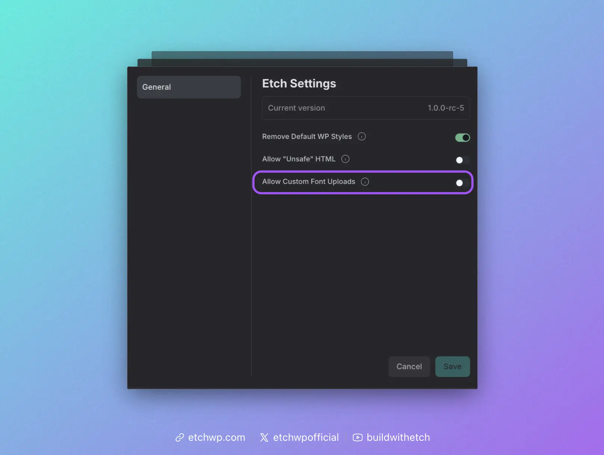

import VersionBadge from '@site/src/components/VersionBadge/VersionBadge';

# How to Install Custom Fonts

<VersionBadge version="1.0.0-rc-5" />

There are two primary methods of adding custom fonts to any website:

1. Local Files (Best)
2. CDN (Alternative)

We'll cover both in this guide.

:::info
Managing fonts is even easier with a framework like [Automatic.css](https://automaticcss.com). If you're an ACSS user, you'll want to follow the ACSS-specific instructions for custom fonts.
:::

## Hosting Fonts Locally

Using custom local fonts is a simple three step process: 

1. Upload the files
2. Add the `@font-face` declarations
3. Set your font family (usually in global CSS)

### Step 1: Upload the Files

WordPress blocks font file uploads to wp-admin by default. To get around this, we've added a toggle in Etch Settings to allow custom font uploads:



Flip that toggle, save changes, and then refresh the builder. You can then open the media library and drag your font files in.

Once your files are uploaded, grab their URL path. You'll need it for the next step.

### Step 2: Add the `@font-face` declarations

CSS requires custom fonts to be declared using `@font-face`.

You can add this to a global stylesheet in Etch ([Style Manager](../../interface/style-manager)) by copying and pasting the example code below, or by deploying the `?font-face` [recipe](../../utilities/recipes/miscellaneous-recipes).

:::tip Stylesheet Tip
Create a new stylesheet called "Typography" so you can keep everything related to typography in one place. Etch lets you create and manage as many stylesheets as you want. This will have no effect on performance.
:::

```css
@font-face {
  font-family: "Your Font Name";
  src: url("/wp-content/uploads/path-to-font.woff2") format("woff2");
  font-style: normal;
  font-weight: 400;
  font-display: swap;
}
```
You need to add a `@font-face` block for each family and/or weight.

For variable fonts, use a weight range instead of a single value and only declare it once per family:

```css
@font-face {
  font-family: "Your Variable Font";
  src: url("/wp-content/uploads/path-to-font-variable.woff2") format("woff2");
  font-style: normal;
  font-weight: 100 900;
  font-display: swap;
}
```

### Step 3: Tell your elements to use that font

Declaring fonts via `@font-face` just makes the custom fonts available, but it doesn't tell which elements to actually use them.

If you're not using a framework like [Automatic.css](https://automaticcss.com), here's our recommended setup:

#### Step 3A: Map Your Fonts to Tokens

Tokenizing your fonts makes them a lot easier to manage and makes your site more maintainable.

Go back to your stylesheet where you declared `@font-face` and add the following:

```css
:root {
  --heading-font-family: "My Font Family";
  --text-font-family: "My Font Family";
}
```

#### Step 3B: Declare Your Defaults

You can declare your defaults in the same exact stylesheet OR you can use the Etch selector system. The two big benefits of the selector system are (1) tree shaking for better performance and (2) element identification of applied styles in the editor with instant access to style modification.

Using the selector system to manage global styles is a little more advanced, so we'll focus on just getting you up and running with the same stylesheet you've been using.

Add the following:

```css
h1,h2,h3,h4,h5,h6 {
  font-family: var(--heading-font-family);
}
body, p, li, a, button {
  font-family: var(--text-font-family);
}
```

That will get you most of the way to where you want to go, but all this stuff is project dependent. This is why a framework like [Automatic.css](https://automaticcss.com) is so valuable. It alleviates you from having to worry about all this stuff.

## Using a CDN for Custom Fonts

Using a CDN is a simple two step process: 

1. Add the `@import` line to your stylesheet.
2. Set your font family (usually in global CSS).

### Step 1: Add the `@import` line

:::warning Performance Note
Local fonts generally perform better than CDN fonts since they avoid external network requests. Consider using local fonts for production sites when possible.
:::

A CDN (Content Delivery Network) hosts font files on distributed servers around the world. When you use a CDN for fonts, your site loads fonts from these servers instead of serving them from your own hosting. It has some benefits, but also comes with significant performance and GDPR (privacy) considerations.


Go to [Google Fonts](https://fonts.google.com) (or your preferred font CDN), select your font family and weights, then copy the `@import` code. Add it to the top of your stylesheet.

Here's an example using Google Fonts:

```css
@import url('https://fonts.googleapis.com/css2?family=Inter:wght@400;500;600;700&display=swap');
```

### Step 2: Set your font family

Follow the same tokenization and declaration process from [Step 3A](#step-3a-map-your-fonts-to-tokens) and [Step 3B](#step-3b-declare-your-defaults) above, using your CDN font name.

Congrats, you should now have functioning custom fonts on your site!