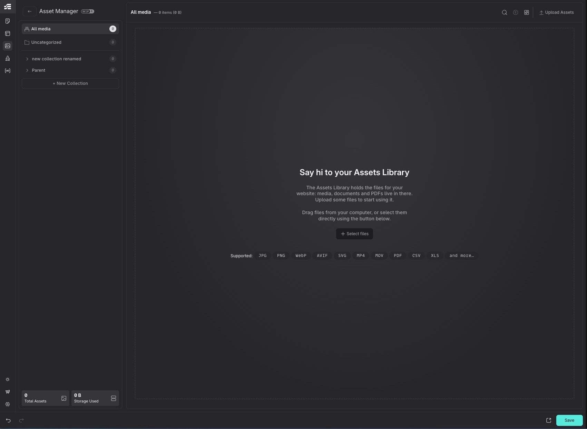

# Asset Manager

The Asset Manager is Etch's native media hub for uploading, organizing, editing, and optimizing all the media files in your project. It replaces the standard WordPress Media Library with a purpose-built experience designed for speed and efficiency.

## Accessing the Asset Manager

There are two ways to open the Asset Manager:

- **Settings bar**: Click the Asset Manager icon in the left settings bar to switch to the full Asset Manager view.
- **Command Bar**: Open the Command Bar (<kbd>Cmd/Ctrl</kbd> + <kbd>K</kbd>) and select "Open Asset Manager".

To return to the builder, click the **Back to Builder** button at the top of the sidebar.

:::info
The Asset Manager can also appear as a **picker dialog** when you interact with image-related properties (e.g. the Image element source or a Media component prop). In this mode, it opens as a full-screen overlay with Select/Cancel buttons, and selection is limited to a single item.
:::

## Interface Overview

The Asset Manager is organized in two areas:

1. **Sidebar** (left): shows the collection tree, an "All media" shortcut with total count, an "Uncategorized" filter, and storage stats (total assets and total file size).
2. **Content area** (right): shows the asset grid or list, a search bar, view toggle, and upload button. When a single asset is selected, a detail panel appears alongside the list.

## Views

You can toggle between two views using the button in the content header:

### List View

A table with columns for thumbnail, filename, alt text, MIME type, file size, and quick actions. The alt text column is **inline-editable**: click on it to edit directly in the table. The header row includes a **select-all checkbox**.

### Grid View

A masonry-style grid that shows image thumbnails at a glance. Useful for visual browsing.

## Uploading Assets

You can upload files in two ways:

- **Upload button**: Click "Upload Assets" in the content header to open the file picker. You can select multiple files at once.
- **Drag and drop**: Drag files from your machine directly into the content area. An overlay will appear showing the supported file types. Files are uploaded into the currently active collection.

Supported file types include: JPG, PNG, WebP, AVIF, SVG, MP4, MOV, PDF, CSV, XLS, and more.

## Managing Assets

### Selecting Assets

- **Click** an asset to select it. Click again to deselect.
- **Hold** <kbd>Shift</kbd>  or <kbd>Cmd/Ctrl</kbd> and click to toggle individual items.
- Press <kbd>Esc</kbd> to clear the selection.

### Asset Details

When one asset is selected, a **detail panel** appears showing:

- A large image preview (or file type icon for non-image files)
- File path with a **Copy URL** button
- Type and file size badges
- An editable **alt text** field
- Image dimensions (width × height)
- Collection badges (click to navigate to that collection)
- **Delete** and **Compress** action buttons

### Alt Text

Alt text can be edited in two places:

- **Inline** in the list view (click the alt text cell)
- In the **detail panel** textarea

### Deleting

Click the delete button in the detail panel or in the list view actions. A confirmation dialog will appear before the asset is permanently removed.

### Copy URL

Click the **Copy URL** button in the detail panel or list view actions to copy the asset's serving URL to the clipboard.

## Bulk Actions

When two or more assets are selected, a **bulk actions bar** appears at the bottom of the screen. It shows the selection count and offers:

- **Clear selection**
- **Select All**: selects every asset in the current view.
- **Add to...**: opens a collection popover to assign all selected assets to one or more collections.
- **Compress**: opens the [bulk compression](#bulk-compression) overlay.
- **Delete**: deletes all selected assets (with confirmation, since it's a destructive action).

## Collections

Collections let you organize your assets into named groups; similar to folders, but an asset can belong to multiple collections at once.

### Creating a Collection

Click **"+ New Collection"** at the bottom of the sidebar. Type a name and press <kbd>Enter</kbd>.

### Nested Collections

Collections support **one level of nesting**. To create a sub-collection, right-click a top-level collection and select **"New sub-collection"**.

### Navigating

Click a collection in the sidebar to filter the content area to only show assets in that collection. Click **"All media"** to see everything, or **"Uncategorized"** to see assets that don't belong to any collection.

### Assigning Assets to Collections

There are several ways to assign assets:

- **Drag and drop**: drag one or more assets from the list or grid onto a collection in the sidebar. A visual indicator follows your cursor showing thumbnails of the dragged items.
- **Collection popover**: click "Add to..." to open a popover with checkboxes for each collection. This is available on individual assets in the list view actions column, as well as in the bulk actions bar for multiple selections.

### Renaming and Moving

- **Double-click** a collection name, or right-click and select **"Rename"**.
- Right-click a collection to access **"Move into..."** (move it inside another collection) or **"Move to top level"**.
- Collections can also be **reordered** by dragging them within the sidebar.

### Deleting a Collection

Right-click a collection and select **"Delete"**. This removes the collection only — assets inside it are not deleted. Any sub-collections are moved to the top level.

## Image Editor

Select an image and click **Compress** (from the detail panel or list view) to open the Image Editor overlay. It provides tools for compression, resizing, format conversion, and cropping.

### Compression

Use the **compression slider** to control how aggressively the image is compressed. Higher values produce smaller files at the cost of visual quality. The slider labels range from **Light** to **Max**.

### Output Format

Choose a target format from: **WebP**, **AVIF**, **JPEG**, or **PNG**. Converting to WebP or AVIF typically offers significant file size savings.

### Resizing

Three resize modes are available:

- **Fixed dimensions**: set an exact width or height in pixels (the other dimension scales proportionally).
- **Relative dimensions**: set the longest or shortest side to a specific pixel value.
- **Percentage**: scale the image by a percentage of its original size.

Each mode has a **downscale-only** option to prevent images from being upscaled beyond their original resolution.

### Cropping

Click the **crop** button in the toolbar to enter crop mode. An interactive overlay lets you drag to define the crop region.

Available aspect ratio presets: **Freeform**, **1:1**, **4:3**, **3:2**, **16:9**, **2:3**, **9:16**, and **Original**.

Use the width and height inputs in the crop panel for precise control.

### Preview

Before applying changes, you can compare the original and the result using:

- **Slider mode**: drag a divider left/right to reveal the before and after.
- **Side by side mode**: view both versions next to each other.

Toggle between modes using the toolbar button.

### Saving

- **Overwrite**: replaces the original file (preserving its URL).
- **Save as new**: creates a new asset with a custom filename.

## Bulk Compression

Select multiple images, then click **Compress** in the [bulk actions bar](#bulk-actions). This opens a dedicated overlay where you can:

- Configure **shared compression settings** (quality, format, resize) that apply to all selected images.
- See a **grid preview** of each image being processed. Each thumbnail has a **compare button** — press and hold it to temporarily show the original image, giving you instant visual feedback on the compression result for that specific image.
- Track **progress** as each file is compressed.

## Compression Presets

If you find yourself using the same compression settings often, you can save them as a **preset**:

- In the Image Editor or Bulk Compression panel, configure your settings and click **Save as preset**.
- Saved presets appear as clickable **badges** at the top of the compression panel — click one to apply its settings instantly.
- Presets can be edited or deleted at any time.

A preset stores: compression level, output format, resize options, and the overwrite preference.
