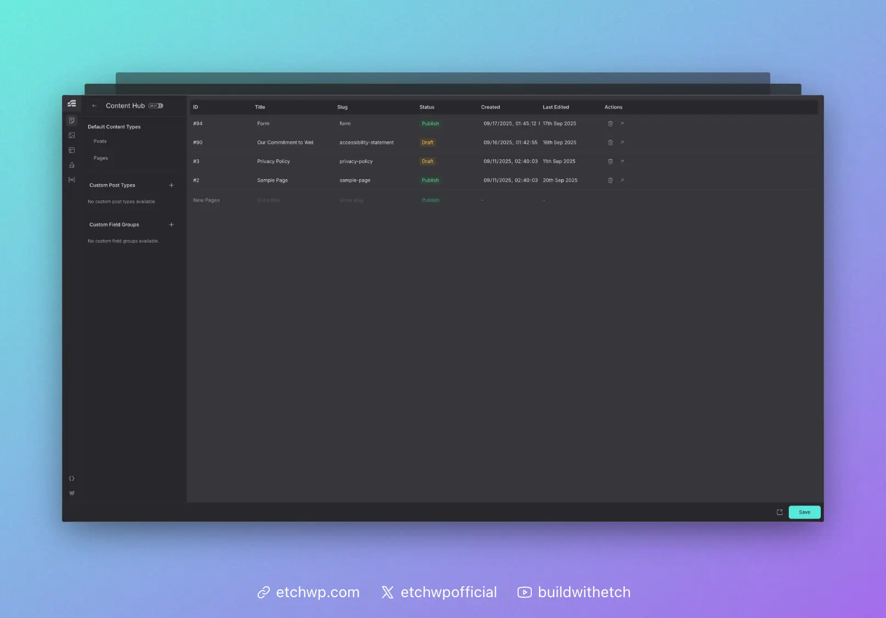

# Content Manager

The Content Manager empowers users to edit, add, and navigate-to content across the project.

Content Management in WordPress mainly consists of:

- Post Content
- Page Content
- Custom Post Type Content
- Custom Field Content
- Media Content

Etch supports the creation and management of all these content types natively. The only caveat is that media content is managed separately in the Media manager since it's such a distinct content type with unique requirements.

## Posts & Pages

The Content Manager allows you to create, edit, delete, and navigate to any post and page in the project. More inline and bulk editing controls are coming to the Content Manager soon.

## Custom Post Types

:::warning
This area of Etch is mainly for proof-of-concept and playground purposes only. It's not recommended to use this area in production due to current limitations.
:::

The Content Manager allows you to create, edit, and delete Custom Post Types as well as navigate to any post in any type across the project. More custom post type feaures as well as inline and bulk editing controls are coming to the Content Manager soon.

## Custom Fields

:::warning
This area of Etch is mainly for proof-of-concept and playground purposes only. It's not recommended to use this area in production due to current limitations.
:::

The Content Manager allows you to create, edit, and delete Custom Fields and Custom Field Groups as well as control where they're assigned. More custom field features as well as inline and bulk editing controls are coming to the Content Manager soon.