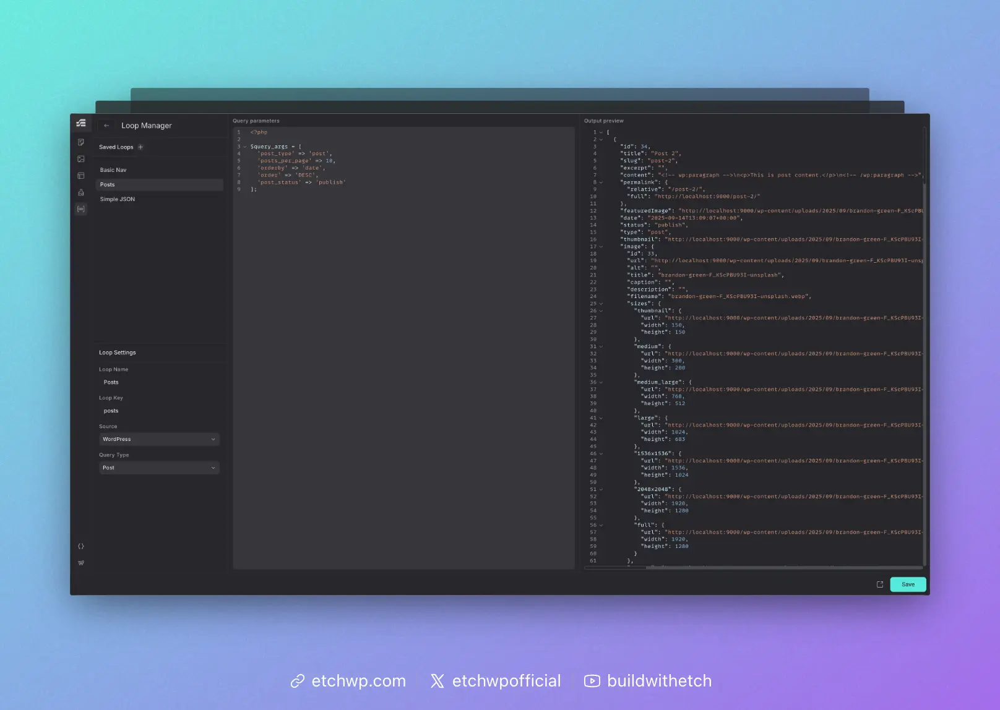

# Loop Manager

The Loop Manager allows you to manage all main loops for your project, whether they be post loops, taxonomy loops, or JSON loops.

The loops you define in the Loop Manager are accessible via the [Loop element](/elements/loop).

## Interface Overview

The Loop Manager consists of three columns: 

1. Saved Loops & Basic Configuration
2. Query Loop Parameters
3. Output Preview

Working from left to right, you can click on a saved loop or create a new loop, view or configure the loop settings (name, key, source, type), define the parameters, and then view the output.

Once you're done viewing, editing, or creating a loop, you can click the arrow or hit `esc` to return to site building mode.

For more information on using loops, see [Basic Loops](/loops/basic-loops).