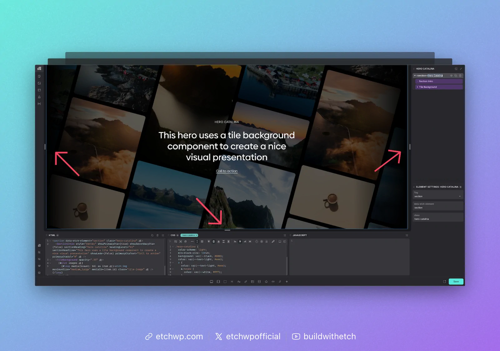
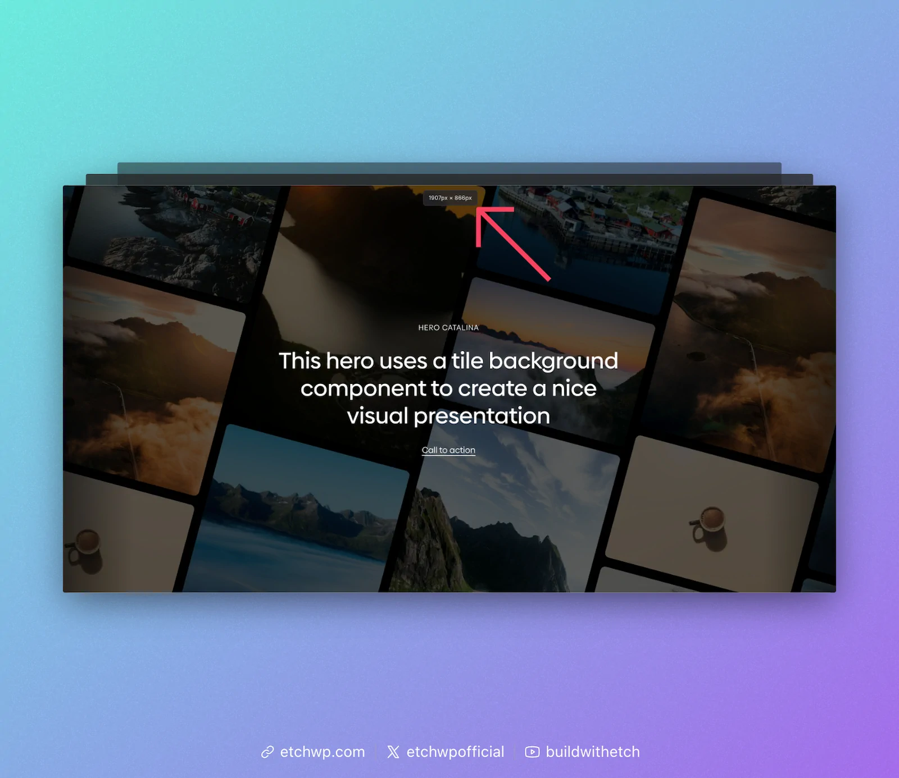
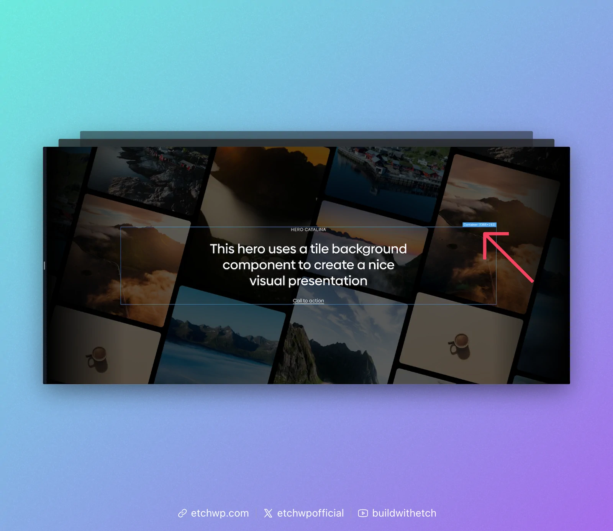
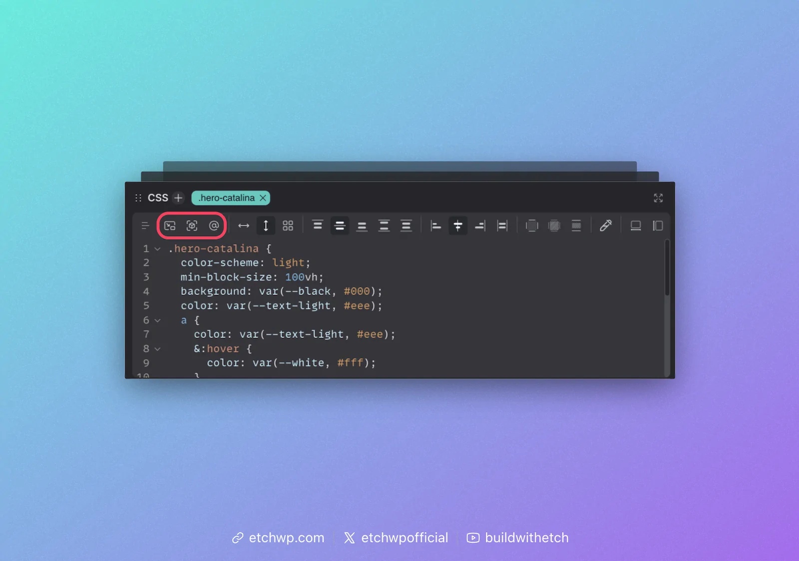

# Responsive Controls

Etch's interface looks very different from most page builders in terms of responsive controls. This is because all other current page builders are using heavily outdated workflows and practices for responsiveness.

Once you start using Etch for responsive development, you'll see why its such a transformative experience.

First, please make note of the following:

1. There are no device-based breakpoints anywhere because device-based breakpoints are functionally irrelevant on the modern web. You can't configure them, nor can you preview them, because they no longer matter.
2. The canvas scales fluidly with no preset preview sizes. This ensures that you're checking responsiveness throughout the entire range of possible device sizes rather than random, irrelevant "snapshot" sizes.

If you open Etch expecting to see these relics of Era 2 and 3 development practices, you may feel confused at first. But once you understand how irrelevant and inaccurate the old workflow is, and how Etch handles responsive development, you'll be wondering why no other tools implemented these new practices sooner.

## Fluid Canvas

Responsive development in Etch begins with the fluid canvas. On each side of the canvas you'll see a drag handle. This allows you to fluidly drag the canvas through the entire range of responsiveness.

Sites built with Etch are far more responsive than sites built with fixed breakpoints because Etch users can easily check how their site looks on all 2200+ known device sizes instead of just three or four.

## Persistent CSS Editing

One thing you'll notice in Etch is that you can see all your styling at all times, no matter how big the canvas is. In other page builders, previewing a breakpoint completely resets your styling and clears your CSS editor. In Etch, your CSS editor is unaffected by responsive previews. You can add styles for any "breakpoint" at any time, from any preview state. This dramatically improves development efficiency and reduces frustration and clicks.

## Canvas Auto Measuring

Whenever you interact with the responsive drag handles, you'll see a canvas measurement appear at the top of the canvas. This lets you know the exact dimensions of your canvas in the current preview state.

You'll see why this is important in a moment.

## Element Auto Measuring

Any time you have an element selected on the canvas, you'll see its measurements. Etch automatically calculates the precise measurement of every element in any given preview state.

You'll see why this is important in a moment.

## Auto Query Insertion for Responsive Styles

Etch speaks the language of web development, thus it uses media queries and/or container queries for responsive styling rules.

The best part, though, is that you never have to write these queries. Etch will auto-insert them for you. Not only will it auto-insert a responsive style query, it will add the query to your CSS using the exact measurements of your canvas or element.

For media queries, it'll automatically add the exact canvas measurement that you're currently previewing.

For container queries, it'll automatically add the exact element measurement that you're currently previewing.

This means that, as you preview different points to make responsive adjustments, Etch just auto-feeds the queries for that "breakpoint" directly into your CSS.

:::note Tip!
Once you're in a container query or media query code block, the CSS Mini GUI (CSS Quick Actions Bar) will reset so you can easily start adding your styling changes. You do not have to write CSS for media/container queries.
:::

## Auto "Has Me" Insertion

One of the icons in the responsive controls menu is an auto-insertion for the "Has Me" selector. This is a breakthrough selector for container queries, pioneered and popularized by Etch's own [Kevin Geary](https://geary.co/).

For a detailed explanation of the Has Me selector, see [Kevin Geary's article on "Has Me"](https://geary.co/has-me/).

Whenever you're going to use a container query, it's advisable to add the Has Me selector first. This will ensure your container query works everywhere, automatically.

## Conclusion

Not only are Etch sites more accurately responsive, it's far easier and faster to develop them with a high degree of accuracy than it is in other tools.

To dive deeper, check out our [Responsive Development Philosophy](/responsive-development/philosophy).