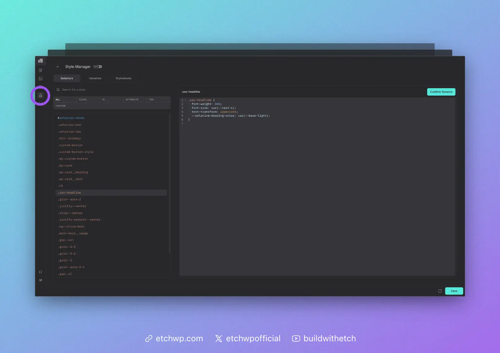

# Style Manager

The Style Manager empowers users to manage selectors, variables, and global stylesheets. You can access it by clicking the Style Manager icon in the left Etch bar.

## Selector Manager

The selector manager shows you all of the selectors in your project. You can use the sorting controls to filter the list or use the search bar to find selectors based on names, characters, etc.

Clicking on a selector allows you to:

- View and edit the CSS applied to that selector
- Rename the selector
- Delete the selector

More functionality is planned for the Selector Manager in the future.

## Variable Manager

If you click on the Variables tab, you'll gain access to the Variable Manager. This is where you can define global CSS variables (custom properties) for your project. You can even organize variables into collections.

More functionality is planned for the Variable Manager in the future.

## Stylesheets Manager

If you click on the Stylesheets tab, you'll gain access to the Stylesheets Manager. This is where you can define global CSS for your project. You can even organize stylesheets into collections.

More functionality is planned for the Stylesheets Manager in the future.