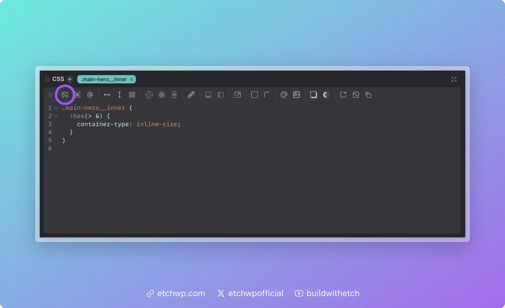

# Using Container Queries

Container queries are a powerful CSS feature that allows you to style elements based on the available space they're placed in, rather than the viewport. This enables more modular and reusable components that adapt to their context, regardless of where they're placed on the page.

:::info
Container queries are fundamentally different from media queries. While media queries respond to the size of the viewport (the device or browser window), container queries respond to available space, enabling truly context-aware responsive design. To learn more about the philosophy behind this approach and why Etch promotes container queries over traditional breakpoints, see the [Philosophy](./philosophy) article.
:::

## How Container Queries Work

Container queries require two things:

1. **A query container** — a parent element that tracks its own size
2. **A container query rule** — a style block that applies when the container reaches a certain size

### Step 1: Define a container

A parent element needs `container-type: inline-size` to become a query container. This tells the browser to track the element's inline (horizontal) size so that descendant elements can query against it.

The most effective way to do this is with the "Has Me" selector — `:has(> &)`. Instead of manually adding `container-type` to a specific parent class, you declare it from the component/block itself:

```css
.card {
	:has(> &) {
		container-type: inline-size;
	}
}
```

This targets whatever element is the direct parent of `.card` and sets it as a container. The advantage is that the component carries its container context with it — no matter where `.card` is placed, the parent automatically becomes the query container. You don't have to remember to add `container-type` to a separate selector, and the component remains fully portable.

Etch can auto-insert the "Has Me" selector for you via the responsive controls — just click the "Has Me" icon in the CSS Quick Actions Bar. It's recommended to add it before writing any container queries.



You can also define a container manually on a specific parent if needed:

```css
.card-grid {
	container-type: inline-size;
}
```

This approach works fine, but couples the container query behavior to a specific parent. If `.card` moves to a different context, you'd need to ensure the new parent also has `container-type` set.

### Step 2: Write a container query

Once a container is defined, you need a `@container` rule to apply styles based on the container's width.

The easiest way to do this in Etch is with **auto container query insertion**. Drag the canvas to the point where your design needs to change, and click the container query button in the CSS Quick Actions Bar. Etch will auto-insert an `@container` block using the selected element's exact measurement as the query condition — no manual pixel values needed. The CSS Quick Actions Bar then resets so you can immediately start adding styles inside the query.


The result looks like this:

```css
.card {
	display: grid;
	gap: 1rem;

	:has(> &) {
		container-type: inline-size;
	}

	@container (width >= 500px) {
		grid-template-columns: 200px 1fr;
	}
}
```

In this example, `.card` switches to a two-column layout when its container is at least 500px wide — regardless of the viewport size. The same card could appear in a full-width section, a sidebar, or a grid column, and it adapts to each context automatically.

## Container Queries in Etch

Etch streamlines the container query workflow so you rarely have to write query conditions by hand.

### Auto query insertion

When you have an element selected and drag the canvas to a size where you want responsive changes:

1. Etch displays the **exact measurement** of the selected element
2. Click the container query button in the responsive controls
3. Etch auto-inserts a `@container` block using the element's current measurement as the query condition
4. The CSS Quick Actions Bar resets so you can immediately add styles

This means your container query breakpoints are always driven by the actual dimensions where your design needs to change.

### Auto "Has Me" insertion

The responsive controls also include a dedicated button to auto-insert the `:has(> &)` container declaration. Use this before adding your first container query on a selector.

## When to Use Container Queries

Container queries are the right choice when a component's layout should depend on **how much space it has**, not how big the screen is. This covers most responsive scenarios:

- **Cards** that switch between stacked and horizontal layouts
- **Navigation** that collapses based on available width
- **Sidebars** that reorganize when the main content area shrinks
- **Grid items** that adapt as column counts change
- **Any reusable component** that might appear in different contexts

## Container Queries vs. Media Queries

| | Container Queries | Media Queries |
|---|---|---|
| **Responds to** | Available space (parent container) | Viewport size (browser window) |
| **Best for** | Component-level responsiveness | Global layout and viewport concerns |
| **Reusability** | Components adapt to any context | Components tied to viewport assumptions |
| **Etch's recommendation** | Primary tool for responsive design | Use when you specifically need viewport awareness |

For scenarios where you do need viewport-based queries, see [Using Media Queries](./using-media-queries).

## Syntax Reference

### Basic container query

```css
.component {
	@container (width >= 400px) {
		/* styles when container is at least 400px */
	}
}
```

### With "Has Me" for automatic container context

```css
.component {
	:has(> &) {
		container-type: inline-size;
	}

	@container (width >= 400px) {
		/* styles when container is at least 400px */
	}
}
```

### Multiple query thresholds

```css
.component {
	/* Base: single column, stacked */

	:has(> &) {
		container-type: inline-size;
	}

	@container (width >= 400px) {
		/* Mid-size adjustments */
	}

	@container (width >= 700px) {
		/* Larger container adjustments */
	}
}
```

### Using @custom-media tokens

If you have recurring container query conditions, define them as `@custom-media` tokens and reference them by name:

```css
.component {
	:has(> &) {
		container-type: inline-size;
	}

	@container (--component-wide) {
		grid-template-columns: 200px 1fr;
	}
}
```

See [Custom Media](./custom-media) for setup details.
