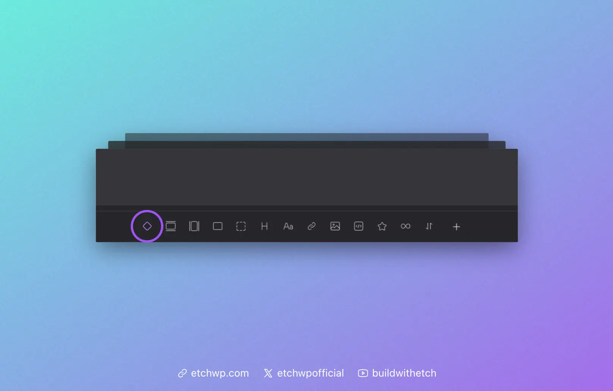

# Post Content

The **Post Content** tag pulls Gutenberg-based content into Etch. It's used almost exclusively when creating templates.

Instead of pulling Gutenberg's content into a template with a dynamic data tag like `{this.content}`, you should pull Gutenberg's content with Post Content `{@post-content}`.

When editing a template, you'll see the icon for the Post Content Slot in the Element Bar:



Click that icon and Etch will insert a Post Content Slot for you automatically.

## Index Template

In your Index Template, Post Content usually goes inside of a `main` tag:

```html
<main>
    {@post-content}
</main>
```

## Blog Post Template

In your Blog Post Template, Post Content usually goes inside of a `article` tag:

```html
<article>
    {@post-content}
</article>
```

It's your job as a developer to determine where the content should be appropriately injected into any given template based on the structure of that template.

:::warning Note about @post-content "slot"
The @post-content dynamic data tag is sometimes referred to as a "slot," but it's a specialized dynamic data tag that is not subject to slot logic the way other slots are. Don't try to use slot logic on this tag.
:::
