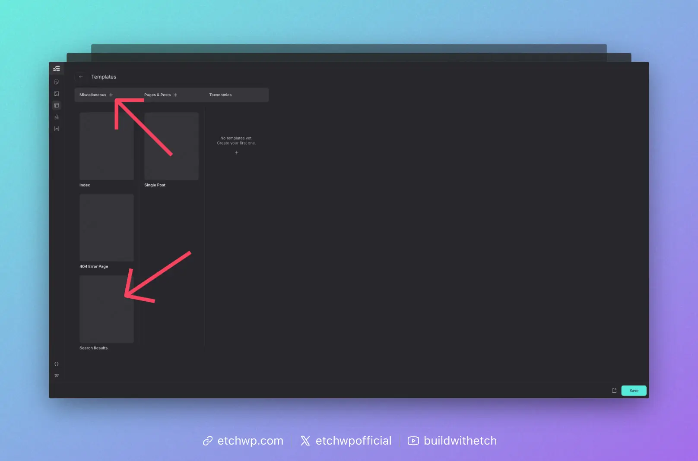

# Search Results Template

A Search Results Template displays the results of an internal site search.

To build a functional search results template, you'll need:

1. The template itself (via Etch).
2. A loop that uses WordPress's **main query** to display the results.
3. (Optional) Loop arguments to control how many results are shown. You can see the available query arguments for `mainQuery` in the Loop Manager and use them as loop arguments.
4. A search form (custom or pre-made).

Follow the steps below to build a search results template in Etch.

## Step #1: Create the Template



From the Etch Template Manager, click the plus sign next to "Miscellaneous" and then choose "Search Results."

This will generate a WordPress search results template.

Once the template appears in the Misc column, hover over its thumbnail area and click "edit."

## Step #2: Configure the Loop with the WordPress Main Query

You can add whatever content you want to the search results template, but the heart of the template is the loop that will dynamically display a visitor's search results.

On a search results template, WordPress already builds a **main query** that contains the visitor's search results based on the `s` parameter in the URL. In most cases, you don't need to configure a separate custom loop. You can simply use Etch's `mainQuery` data source, which is pre-configured to work with WordPress's search results. For a deeper dive into how `mainQuery` works, see [Main Query Loops](/loops/main-query).

The simplest version looks like this:

```html
{#loop mainQuery as item}
  <!-- Render each search result -->
{/loop}
```

This will iterate over whatever WordPress has already queried for the search results page.

If you want more control (for example, limiting the number of results shown in this specific loop), you can use [loop arguments](/loops/loop-arguments) with `mainQuery`:

```html
{#loop mainQuery($count: 10) as item}
  <!-- Render up to 10 search results -->
{/loop}
```

`$count` here is a loop argument that tells Etch how many items to return from the main query for this loop.

Once your loop is in place, you can add whatever markup you want inside it to display each search result.

At a minimum, you might include a heading with a link inside it. The heading would display `{item.title}` and the link would point to `{item.permalink.relative}`. For example:

```html
{#loop mainQuery as item}
  <h2><a href="{item.permalink.relative}">{item.title}</a></h2>
{/loop}
```

This will output a list of search result titles, each linked to its corresponding post or page.

When you first create a Search Results template in Etch, the generated markup is typically just a `<main>` element with a `{@post-content}` element inside it. This needs to be replaced with your custom search layout when using `mainQuery`.

Here's an example of a more complete search archive layout:

```html
<main>
  <section data-etch-element="section" class="search">
    <div data-etch-element="container" class="search__header">
      <h1 class="search__title">Search results for: {url.parameter.s}</h1>
    </div>
    <div data-etch-element="container" class="search__results">
      {#loop mainQuery as item}
        <article class="search-card">
          <h2 class="search-card__title"><a href={item.permalink.relative}>{item.title}</a></h2>
          <div class="search-card__description">{item.excerpt}</div>
        </article>
      {/loop}
    </div>
  </section>
</main>
```

You can customize the classes and structure to match your design system, but the core idea is the same: use `{#loop mainQuery as item}` to iterate over search results, then map `item` fields (like `title`, `permalink.relative`, and `excerpt`) into your markup.

## Step #3: Add a Search Form

You can add a search form in WordPress any number of ways. Our recommended approach at this time is to use [WS Form](https://gearyco.link/wsform). There's a 1-click search results form template in both the free and pro version.