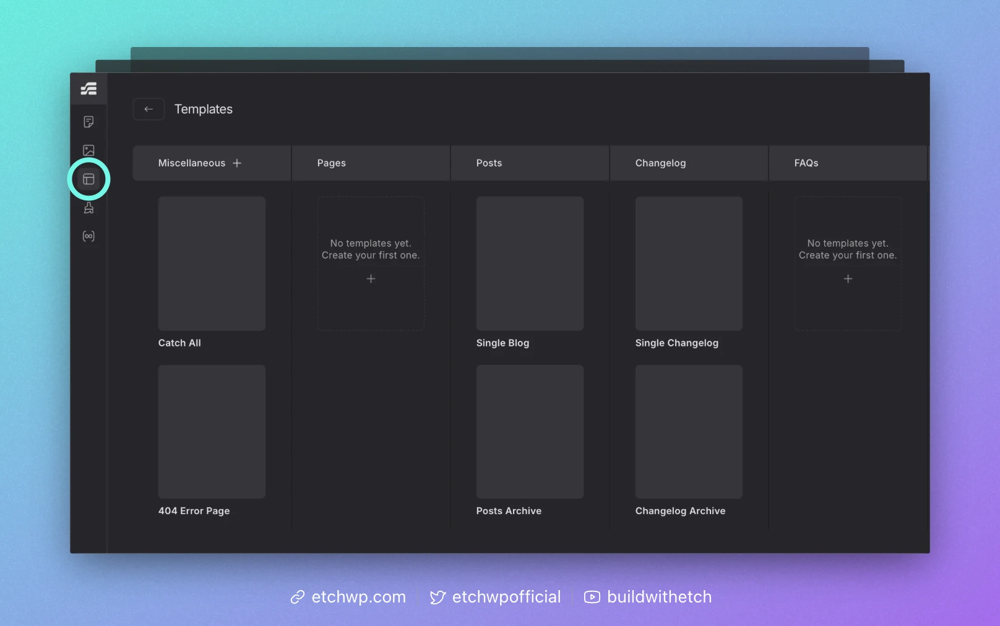

# Template Manager

Etch allows you to create and manage templates at any time via the template manager.

This area of Etch presents your site's templates in a column-based layout, giving you a convenient overview of you site's architecture.

As you create new content types (custom post types) or taxonomies, new columns will show up here to signify that new templates can be created.

Remember, every template created here is automatically authored to WordPress' FSE templating system, so you're always fully synced with core WordPress.