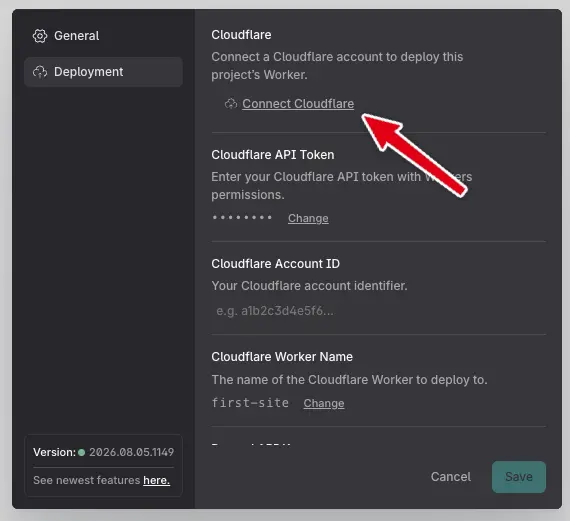
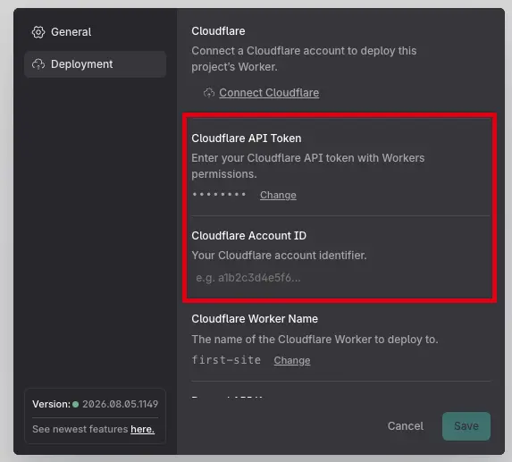

# Deploying

Studio renders every page of your project to static HTML, CSS, JS and assets.
Two ways to get that out of the builder:

- **Download Site** in the action bar produces `site.zip`, the build as plain
  files, ready for any static host.
- **Deploy** publishes it directly to a hosting target you've connected.

**Cloudflare Workers is the deploy target available today.** More targets are
planned; deploying somewhere else in the meantime means downloading the build and
uploading it yourself.

Etch Studio never hosts your site. It builds the artifact; you own where it runs,
which is also why your site's uptime never depends on ours.

## What gets deployed

Every page is rendered on the server, so **anything dynamic is resolved at build
time and baked into the output**. A [data source](data-sources/README.md) that
calls an external API is fetched during the build, and the deployed site serves
whatever that call returned. To publish fresh data, deploy again.

## Deploying to Cloudflare

Studio publishes to a **Cloudflare Worker with static assets**, running on your
own Cloudflare account. Two ways to give it access:

| Method                                            | When to use it                                             |
| ------------------------------------------------- | ---------------------------------------------------------- |
| **[OAuth](#connect-with-oauth-recommended)**      | The default. Select a button, approve in Cloudflare, done. |
| **[API token](#configure-an-api-token-manually)** | When you want a scoped token you control.                  |

Either way, you also need a **Worker name**.

### Connect with OAuth (recommended)

1. In the builder, open **Settings** (bottom of the left rail).
2. Go to the **Deployment** tab.
3. Select **Connect Cloudflare** and approve the authorization.

Studio comes back with the connection stored, and fills in **Worker Name** from
your project's name if it was empty, so there's usually nothing left to
configure.



Once connected, the API Token and Account ID fields disappear, since they're what
OAuth replaces. **Reconnect Cloudflare** re-runs the flow; **Disconnect
Cloudflare** drops the connection.

A connection belongs to a **project**, so authorize each project separately even
when they all deploy to the same Cloudflare account.

### Configure an API token manually

Three values, all on **Settings → Deployment**.

**Account ID.** Sign in to the
[Cloudflare Dashboard](https://dash.cloudflare.com), select your account, and
copy the ID from the URL (`https://dash.cloudflare.com/<account-id>`) or from the
three-dot menu next to **+ Add**.

**API Token.** Go to
[API Tokens](https://dash.cloudflare.com/profile/api-tokens) → **Create Token**,
use the **Edit Cloudflare Workers** template (or a custom token with **Account** →
**Workers Scripts** → **Edit**), scope it to the right account, and copy it.
Cloudflare only shows it once.

**Worker Name.** See below.



### Worker name

Any name works, like `my-site` or `acme-marketing`. The Worker is created on your
account the first time you deploy, and served at:

```text
https://<worker-name>.<your-subdomain>.workers.dev
```

If you'd rather create the Worker yourself in the Cloudflare dashboard, enter its
name here and Studio deploys into it.

Names are normalized to what Cloudflare accepts (lowercase, hyphens).

### Deploying

Select the **cloud upload** button in the action bar. It stays disabled until the
project has credentials _and_ a Worker name, and the tooltip then reads
"Configure Cloudflare settings first".

On success you get a toast with the live URL, and the **link** button beside it
opens the deployed Worker any time.


### Size limit

The total site must stay under **25 MB**, Cloudflare's limit for Workers static
assets. A deploy over the limit is refused before anything is uploaded, with the
actual size in the message. Large images are usually the cause; the Asset
Manager's compression presets are the first place to look.

### Troubleshooting

**The deploy button is disabled.** Missing credentials or a missing Worker name.

**"Deploy failed" with an authorization error.** For OAuth, use **Reconnect
Cloudflare**. For a manual token, confirm it has **Workers Scripts: Edit** on the
account the Account ID points at.

**The site deployed but the data is stale.** Expected: data resolves at build
time. Deploy again.
