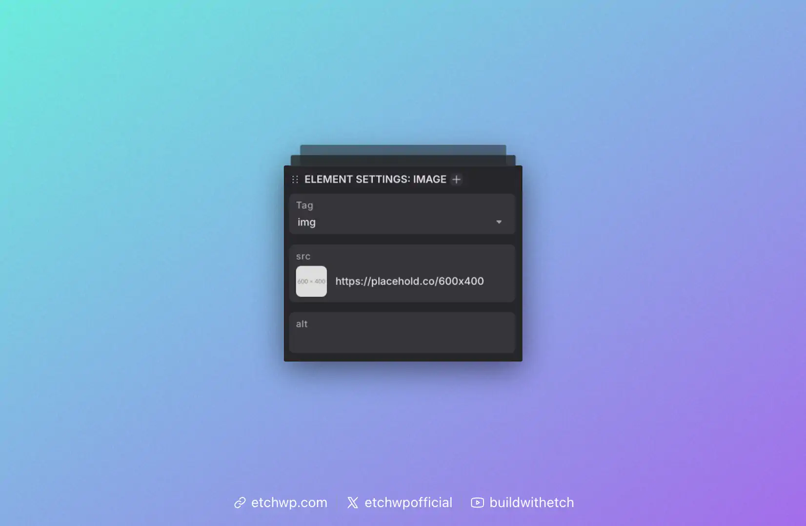

# Image

The Image element creates a standard HTML image tag with the `src` and `alt` attributes automatically added. You can edit the `src` and `alt` via the HTML editor, the Attributes Panel, or the Add Attribute Bar.


Example output:

```html

```

## Essential Attributes & Selecting an Image

You can click on the thumbnail in the image attributes panel to to open the asset picker and choose an image. This will replace the `src` attribute with the path to the new image.



### `src`
The `src` attribute is mandatory and contains the URL or path to the image file. This is automatically added with a placeholder path when you add an Image element to the canvas.

### `alt`
The `alt` attribute provides alternative text for screen readers and accessibility. It's crucial for web accessibility and should describe the image content.

```html

```

## Additional Attributes

You can add any additional attributes you'd like, such as:

### `loading`
Control when the image loads:

```html
<!-- Lazy load (default for images below the fold) -->


<!-- Eager load (for above-the-fold images) -->

```

### `decoding`
Control image decoding:

```html
<!-- Async decoding (default) -->


<!-- Sync decoding (for critical images) -->

```

## Working with Dynamic Data

Rather than statically referencing a source, you can insert a dynamic data key as the src. For example, if you're looping through items, you can dynamically reference the post's Featured Image:

```html

```

All attributes support dynamic data.

Read more about [Dynamic Data Keys](../../dynamic-data/dynamic-data-keys).

## Wrapping Images with a Figure Element

To wrap an image in a `figure` tag, you can right click the image and choose "wrap with div" from the context menu. Once this action occurs, simply change the `div` to `figure`. You can also add a `figcaption` element inside the figure if you'd like. To do this, just add text inside the figure element and change the tag from `p` to `figcaption`.

We're considering making this process more automatic in the future.