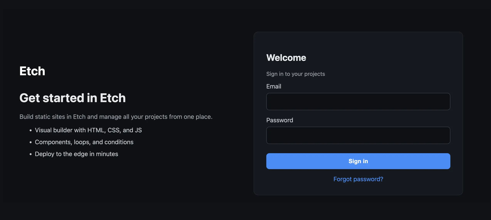
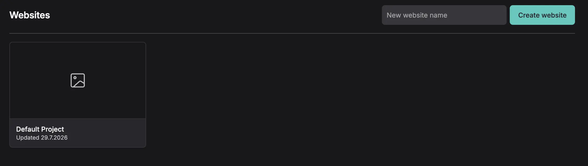
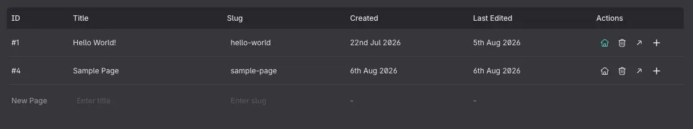

# Getting Started

This guide takes you from a sign-in screen to a published page.

## Signing in

Studio lives at [studio.etchbuilder.io](https://studio.etchbuilder.io).

1. Enter the **email address** your account was created with.
2. Enter your **password**.
3. Select **Sign in**.

Accounts are currently created by the Etch team, so there's no self-serve
sign-up. If you don't have one yet, ask us for access.

## Creating a website

Signing in lands you on your **Websites** dashboard, which lists every project on
your account.

1. Type a name in the **New website name** field in the header.
2. Select **Create website**.

The name has to be unique on your account. Studio creates the project and drops
you straight into the builder for it.

Each project is a card on the dashboard; selecting one opens its builder. The
card's menu deletes the project, which takes its pages, styles, assets and data
sources with it.

Your account menu is at the bottom of the sidebar, and that's where **Log out**
is.

## Creating your first page

Pages live in the **Content Hub**, which you open from the left rail.

1. Select **Pages** in the sidebar (the **Content** tab).
2. In the table's footer row, type a **title** and, optionally, a **slug**.
   Leaving the slug blank derives one from the title.
3. Select **Create Page**.

Use the home icon on a row to mark that page as the site's homepage; it becomes
`index.html` when the site is built.

Select the page to open it in the builder, then use the **Elements** picker in
the action bar to add elements to the canvas.

### Saving

Studio does not autosave. Use **Save** in the action bar, or <kbd>⌘</kbd> +
<kbd>S</kbd> / <kbd>Ctrl</kbd> + <kbd>S</kbd>. Navigating away with unsaved
changes warns you first.

## Adding dynamic data

Static pages are the starting point, not the destination:

- Define a **data source** in the Data Manager (a JSON list, an external API, or
  a JavaScript function) and reference it anywhere as `{data('key')}`. See
  [Data Sources](data-sources/README.md).
- Model your own content with **content types**, so a "Team member" page carries
  a job title and a photo alongside its blocks. See
  [Content Types](content-types/README.md).

## Publishing

Studio builds your site to static files. Getting them online is either a
download or a direct deploy; see [Deploying](deploying.md).

Etch Studio never hosts your site. It builds the artifact; where that artifact
lives is your call, which also means your site's uptime never depends on ours.

## Next steps

- [Deploying](deploying)
- [Data Sources](data-sources/README.md)
- [Content Types](content-types/README.md)
- [Forms](forms/README.md)
